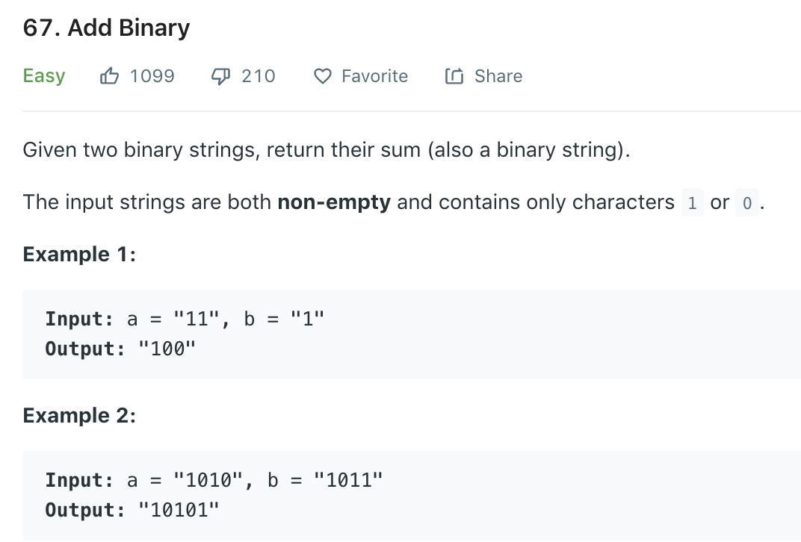

### Solution
Similar to decimal add, just add digit by digit, from the rear to front.
```python
class Solution(object):
    def addBinary(self, a, b):
        """
        :type a: str
        :type b: str
        :rtype: str
        """
        i, j = len(a) - 1, len(b) - 1
        buff = []
        carry = 0

        while i >= 0 and j >= 0:
            sum = carry
            sum += (ord(a[i]) - 48 + ord(b[j]) - 48)

            buff.append(str(sum & 1))
            carry = sum >> 1
            i -= 1
            j -= 1
        
        while i >= 0:
            sum = carry
            sum += (ord(a[i]) - 48)

            buff.append(str(sum & 1))
            carry = sum >> 1

            i -= 1
        
        while j >= 0:
            sum = carry
            sum += (ord(b[j]) - 48)

            buff.append(str(sum & 1))
            carry = sum >> 1

            j -= 1
        
        if carry:
            buff.append(str(carry))
        
        return ''.join(buff[::-1])
```

```python
class Solution(object):
    def addBinary(self, a, b):
        i, j = len(a) - 1, len(b) - 1
        buff = []
        carry = 0
        
        while i >= 0 or j >= 0:
            sum = carry
            if i >= 0:
                sum += ord(a[i]) - 48
                i -= 1
            if j >= 0:
                sum += ord(b[j]) - 48
                j -= 1
            buff.append(str(sum & 1))
            carry = (sum >> 1)
        
        if carry:
            buff.append(str(carry))
        
        return ''.join(buff[::-1])
```
faster solutions from discussion.
```python
class Solution(object):
    def addBinary(self, a, b):
        carry = 0
        i = len(a) - 1
        j = len(b) - 1
        ans = ""
        while i >= 0 or j >= 0 or carry:
            if i >= 0:  
                carry += ord(a[i]) - ord("0")
            if j >= 0:
                carry += ord(b[j]) - ord("0")
            ans = str(carry % 2) + ans
            carry /= 2
            i -= 1
            j -= 1
        return ans
```
Or even
```python
def addBinary(a, b):
        # change to int and make addition
        num =int(a, 2)+int(b, 2)
        # change type to binary
        num =format(num, 'b')
        return num
```