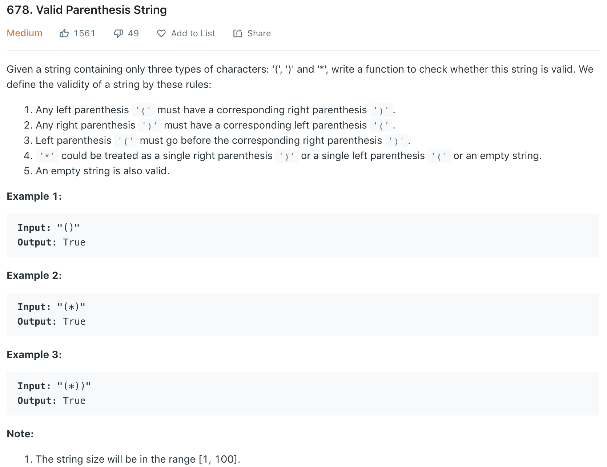
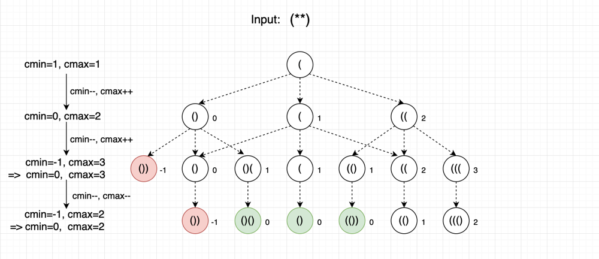

Refer to [here](https://leetcode.com/problems/valid-parenthesis-string/discuss/543521/Java-Count-Open-Parenthesis-O(n)-time-O(1)-space-Clean-Explain) and [here]().<br>
**Simpler question:**  Check Valid Parenthesis of a string containing only two types of characters: '(', ')'
```java
class Solution {
    public boolean checkValidString(String s) {
        int openCount = 0;
        for (char c : s.toCharArray()) {
            if (c == '(') {
                openCount++;
            } else if (c == ')') {
                openCount--;
            }
            if (openCount < 0) return false;    // Currently, don't have enough open parentheses to match close parentheses-> Invalid
                                                // For example: ())(
        }
        return openCount == 0; // Fully match open parentheses with close parentheses
    }
}
```
The idea is to similar to validate a string only contains '(' and ')'. But extend it to tracking the lower and upper bound of valid '(' counts. My thinking process is as following.

scan from left to right, and record counts of **unpaired ‘(’** for all possible cases. For ‘(’ and ‘)’, it is straightforward, just increment and decrement all counts, respectively.
When the character is '*', there are three cases, ‘(’, empty, or ‘)’, we can think those three cases as three branches in the ongoing route.
Take “(**())” as an example. There are 6 chars:<br>
----At step 0: only one count = 1.<br>
----At step 1: the route will be diverted into three branches.
so there are three counts: 1 - 1, 1, 1 + 1 which is 0, 1, 2, for ‘)’, empty and ‘(’ respectively.<br>
----At step 2 each route is diverged into three routes again. so there will be 9 possible routes now.
-- For count = 0, it will be diverted into 0 – 1, 0, 0 + 1, which is -1, 0, 1, but when the count is -1, that means there are more ‘)’s than ‘(’s, and we need to stop early at that route, since it is invalid. we end with 0, 1.
-- For count = 1, it will be diverted into 1 – 1, 1, 1 + 1, which is 0, 1, 2
-- For count = 2, it will be diverted into 2 – 1, 2, 2 + 1, which is 1, 2, 3
To summarize step 2, we end up with counts of 0,1,2,3<br>
----At step 3, increment all counts --> 1,2,3,4<br>
----At step 4, decrement all counts --> 0,1,2,3<br>
----At step 5, decrement all counts --> -1, 0,1,2, the route with count -1 is invalid, so stop early at that route. Now we have 0,1,2.
In the very end, we find that there is a route that can reach count == 0. Which means all ‘(’ and ‘)’ are cancelled. So, the original String is valid.
Another finding is counts of unpaired ‘(’ for all valid routes are consecutive integers. So we only need to keep a lower and upper bound of that consecutive integers to save space.
One case doesn’t show up in the example is: if the upper bound is negative, that means all routes have more ‘)’ than ‘(’ --> all routes are invalid --> stop and return false.

```python

class Solution(object):
    def checkValidString(self, s):
        """
        :type s: str
        :rtype: bool
        """
        lower, upper = 0, 0
        for p in s:
            if p == '(':
                lower += 1
                upper += 1
            elif p == '*':
                lower -= 1
                upper += 1
            else:
                lower -= 1
                upper -= 1

            if lower < 0: lower = 0
            if upper < 0: return False

        return lower == 0
```

### TODO
* at any position i: li + *i >= ri
* |l - r| <= *
* why does this fail: `"(())((())()()(*)(*()(())())())()()((()())((()))(*"`? (should be False, return True)
```python
def checkValidString(s):
    """
    :type s: str
    :rtype: bool
    """
    left_p, right_p, star = 0, 0, 0
    for p in s:
        if p == '(':
            left_p += 1
        elif p == ')':
            right_p += 1
        else:
            star += 1

        if left_p + star < right_p:
            return False

    return abs(left_p - right_p) <= star
```