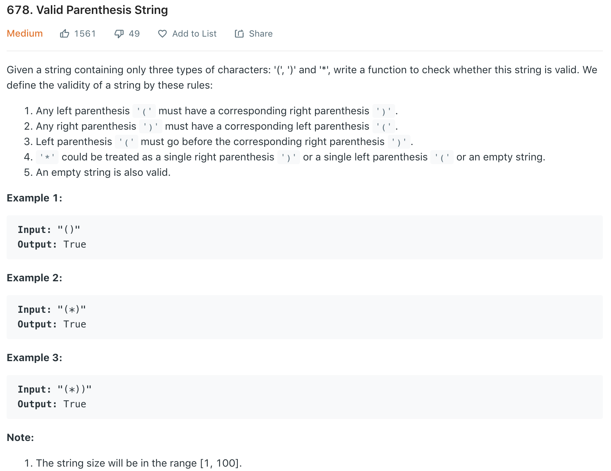
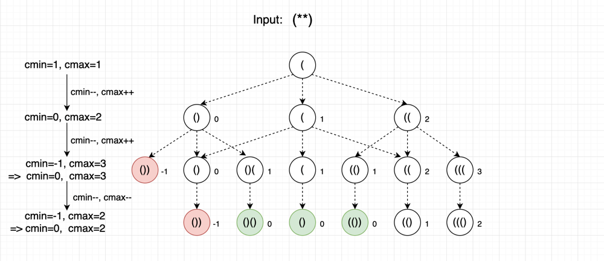

# Valid Parenthesis String

Refer to [here](https://leetcode.com/problems/valid-parenthesis-string/discuss/543521/Java-Count-Open-Parenthesis-O(n)-time-O(1)-space-Clean-Explain) and [here]().<br>
**Simpler question:**  Check Valid Parenthesis of a string containing only two types of characters: '(', ')'
```java
class Solution {
    public boolean checkValidString(String s) {
        int openCount = 0;
        for (char c : s.toCharArray()) {
            if (c == '(') {
                openCount++;
            } else if (c == ')') {
                openCount--;
            }
            if (openCount < 0) return false;    // Currently, don't have enough open parentheses to match close parentheses-> Invalid
                                                // For example: ())(
        }
        return openCount == 0; // Fully match open parentheses with close parentheses
    }
}
```
The idea is to similar to validate a string only contains '(' and ')'. But extend it to tracking the lower and upper bound of valid '(' counts. My thinking process is as following.

scan from left to right, and record counts of **unpaired ‘(’** for all possible cases. For ‘(’ and ‘)’, it is straightforward, just increment and decrement all counts, respectively.
When the character is '*', there are three cases, ‘(’, empty, or ‘)’, we can think those three cases as three branches in the ongoing route.
Take “(**())” as an example. There are 6 chars:<br>
----At step 0: only one count = 1.<br>
----At step 1: the route will be diverted into three branches.
so there are three counts: 1 - 1, 1, 1 + 1 which is 0, 1, 2, for ‘)’, empty and ‘(’ respectively.<br>
----At step 2 each route is diverged into three routes again. so there will be 9 possible routes now.
-- For count = 0, it will be diverted into 0 – 1, 0, 0 + 1, which is -1, 0, 1, but when the count is -1, that means there are more ‘)’s than ‘(’s, and we need to stop early at that route, since it is invalid. we end with 0, 1.
-- For count = 1, it will be diverted into 1 – 1, 1, 1 + 1, which is 0, 1, 2
-- For count = 2, it will be diverted into 2 – 1, 2, 2 + 1, which is 1, 2, 3
To summarize step 2, we end up with counts of 0,1,2,3<br>
----At step 3, increment all counts --> 1,2,3,4<br>
----At step 4, decrement all counts --> 0,1,2,3<br>
----At step 5, decrement all counts --> -1, 0,1,2, the route with count -1 is invalid, so stop early at that route. Now we have 0,1,2.
In the very end, we find that there is a route that can reach count == 0. Which means all ‘(’ and ‘)’ are cancelled. So, the original String is valid.
Another finding is counts of unpaired ‘(’ for all valid routes are consecutive integers. So we only need to keep a lower and upper bound of that consecutive integers to save space.
One case doesn’t show up in the example is: if the upper bound is negative, that means all routes have more ‘)’ than ‘(’ --> all routes are invalid --> stop and return false.

```python

class Solution(object):
    def checkValidString(self, s):
        """
        :type s: str
        :rtype: bool
        """
        lower, upper = 0, 0
        for p in s:
            if p == '(':
                lower += 1
                upper += 1
            elif p == '*':
                lower -= 1
                upper += 1
            else:
                lower -= 1
                upper -= 1

            if lower < 0: lower = 0
            if upper < 0: return False

        return lower == 0
```

### TODO
* at any position i: li + *i >= ri
* |l - r| <= *
* why does this fail: `"(())((())()()(*)(*()(())())())()()((()())((()))(*"`? (should be False, return True)
```python
def checkValidString(s):
    """
    :type s: str
    :rtype: bool
    """
    left_p, right_p, star = 0, 0, 0
    for p in s:
        if p == '(':
            left_p += 1
        elif p == ')':
            right_p += 1
        else:
            star += 1

        if left_p + star < right_p:
            return False

    return abs(left_p - right_p) <= star
```

### Solution 1
由于 * 的不确定性，在任何时刻，未匹配的左括号数量不再是一个确定的值，而是一个区间 [min_left, max_left]。
* max_left：把所有的 * 都当成 (，这是你理论上能拥有的最多左括号数。
* min_left：把所有的 * 都尽可能当成 ) 或空字符串，这是你必须保证合法的最少左括号数。

遍历字符串，根据当前字符更新区间：
1. 遇到 (：
min_left 加 1，max_left 加 1。
2. 遇到 )：
min_left 减 1，max_left 减 1。
3. 遇到 *：
min_left 减 1（把它当成 )）。
max_left 加 1（把它当成 (）。
注：当成空字符串时，区间不变，已经包含在减 1 到加 1 的范围内了)

关键约束：
如果 max_left < 0：说明即使把所有星号都当成左括号，右括号还是太多了。直接判死刑 (False)。
如果 min_left < 0：说明我们把星号当右括号当得太狠了。由于 min_left 代表的是“最少需要的左括号”，它不能是负数（你不能欠着括号）。所以我们要把它重置为 0。
```python
class Solution:
    def checkValidString(self, s: str) -> bool:
        min_left = max_left = 0
        
        for char in s:
            if char == '(':
                min_left += 1
                max_left += 1
            elif char == ')':
                min_left -= 1
                max_left -= 1
            else: # char == '*'
                min_left -= 1
                max_left += 1
            
            # 如果最大可能的左括号都小于0，说明右括号太多了
            if max_left < 0:
                return False
            
            # min_left 不能小于 0，因为我们总是可以把 * 当作空字符串
            if min_left < 0:
                min_left = 0
            # note 重置是必须的as 负数会错误地抵消掉后面本该报错的情况
            # 当你允许 min_left 变成 -1 时，你实际上是在说：“我现在多出了一个右括号，我先欠着，希望以后能有一个左括号来补上。” 但括号匹配的规则是：左括号必须出现在右括号之前
            # * 可以当成右括号来消耗掉已经存在的左括号。
            # 但 * 不能作为一个“预支卡”，去消耗掉还没出现的左括号
            #当你把 min_left 限制在 0 时，你是在强制执行：“如果我现在没有左括号可以抵消了，我就当这个 * 是空字符串，我绝对不欠账。” 如果你允许它变成负数，你就允许了“右括号出现在左括号之前”这种非法情况，只要后面左括号够多，你的 min_left <= 0 就会被骗过去。
                
        # 最后，如果最少需要的左括号能达到 0，说明匹配成功
        return min_left == 0
```
wrong example:
test case
"*("
1. min = -1, max = 1 （如果你不重置为 0）
2. min = 0, max = 2
3. 结束：min = 0。0 <= 0 为 True。（错误！应该是 False）
```python
class Solution:
    def checkValidString(self, s: str) -> bool:
        min_left, max_left = 0, 0
        for l in s:
            if l == "(":
                min_left += 1
                max_left += 1
            elif l == ")":
                min_left -= 1
                max_left -= 1
                if max_left < 0: return False
            else:
                min_left -= 1
                max_left += 1
        return min_left <= 0
```

### 2 stack
We maintain two stacks: one for tracking the indices of left parentheses and another for star indices. As we iterate through the string from left to right, we push indices onto their respective stacks when encountering a left parenthesis '(' or a star '*'.
If the left parenthesis stack is not empty, we pop from it. Otherwise, we pop from the star stack, treating the star as a left parenthesis to keep the string valid.
Now, we try to match the remaining left parentheses with stars, ensuring the stars appear after the left parentheses in the string. We simultaneously pop from both stacks, and if the index of a left parenthesis is greater than that of a star, the string is invalid as there is no matching right parenthesis. In this case, we return false.
```python
class Solution:
    def checkValidString(self, s: str) -> bool:
        leftStk, starStk = [], []
        for i, v in enumerate(s):
            if v == '(':
                leftStk.append(i)
            elif v == '*':
                starStk.append(i)
            else:
                if leftStk:
                    leftStk.pop()
                elif starStk:
                    starStk.pop()
                else:
                    return False
        while leftStk:
            l = leftStk.pop()
            if not starStk or starStk.pop() < l:
                return False
        
        return True
```