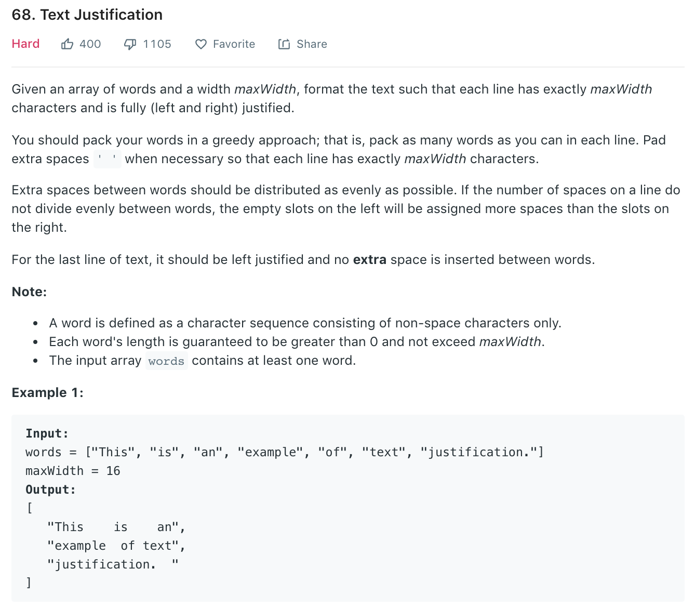

### Solution
Calculate how many words can be placed in current line, then calculate space between words, add it to result.
```python
class Solution(object):
    def fullJustify(self, words, maxWidth):
        """
        :type words: List[str]
        :type maxWidth: int
        :rtype: List[str]
        """
        res, cur, num_of_letters = [], [], 0
        for w in words:
            # current word w cannot be put in current line, add current line to res
            if num_of_letters + len(w) + len(cur) > maxWidth:
                # current line only have one word
                if len(cur) == 1:
                    res.append(cur[0] + ' ' * (maxWidth - num_of_letters))
                else:
                    num_spaces = maxWidth - num_of_letters
                    space_between_words, num_extra_spaces = divmod(num_spaces, len(cur) - 1)
                    for i in range(num_extra_spaces):
                        cur[i] += ' '
                    res.append((' ' * space_between_words).join(cur))
                # reset current line,number of letters in current line
                cur, num_of_letters = [], 0
            # add word w to new line
            cur += [w]
            num_of_letters += len(w)
        
        # Handle remaining words in last line
        res.append(' '.join(cur) + ' '*(maxWidth - num_of_letters - len(cur) + 1))
    
        return res
```