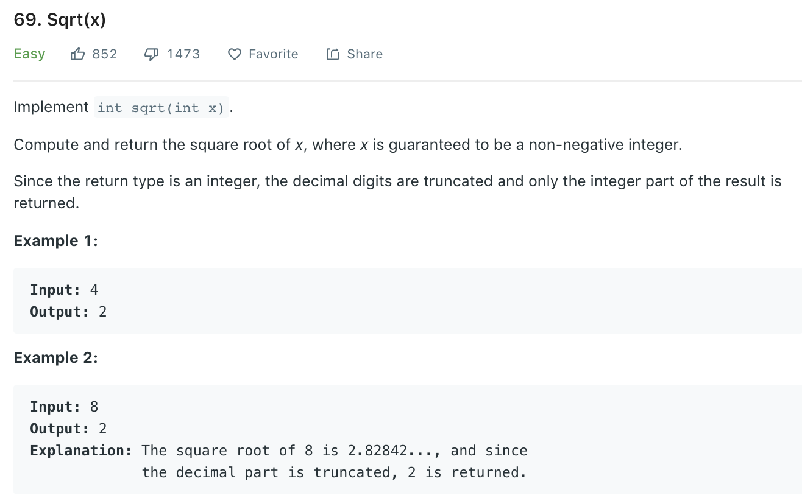

### Solution 1
Newton method.```Xn+1 = Xn - f(Xn)/f'(Xn)```. Here f(Xn) = x^2 - n, Xn+1 = (Xn + n/Xn)/2
```python
class Solution(object):
    def mySqrt(self, x):
        """
        :type x: int
        :rtype: int
        """
        if x == 0: return 0

        r = x
        while r * r > x:
            r = (r + x / r) / 2

        return r
```
### Solution 2
Binary search
```python
class Solution(object):
    def mySqrt(self, x):
        if x == 0: return 0
        l, r = 1, x
        while True:
            mid = l + (r - l) // 2
            if mid > x / mid:
                r = mid - 1
            elif mid + 1 > x / (mid + 1):
                return mid
            else:
                l = mid + 1

```