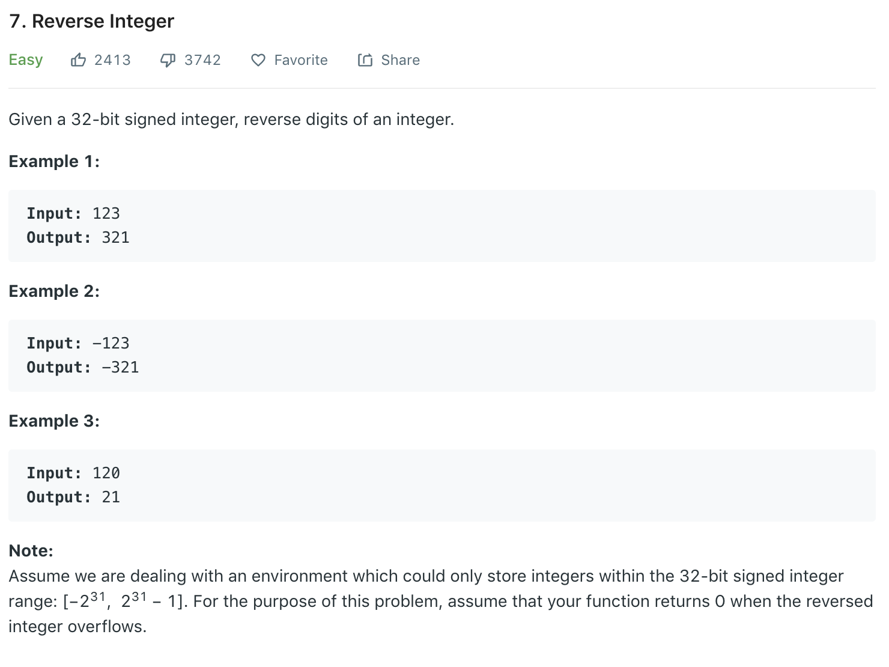

### Solution
```python
class Solution(object):
    def reverse(self, x):
        """
        :type x: int
        :rtype: int
        """
        sign = 1
        if x < 0:
            sign = -1
            x = -x
            
        rev = 0
        while x:
            rev = (rev * 10 + x % 10)
            x = x // 10
        
        rev *= sign
        if rev > ((1 << 31) - 1) or rev < -(1 << 31):
            return 0
        return rev
```