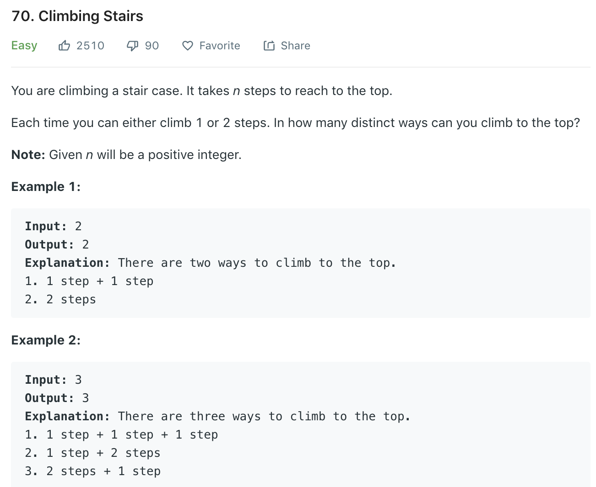

### Solution 1 Recursion
All results to reach the n-th stair can be seperated as two kinds: go one step from n-1 th stair, or go 2 steps from n-2 th stair.
```python
class Solution(object):
    def climbStairs(self, n):
        """
        :type n: int
        :rtype: int
        """
        if n <= 2: return n
        return self.climbStairs(n - 1) + self.climbStairs(n - 2)
```
Add memoization
```python
def climb(n):
    mem = {1:1, 2:2}
    return helper(n, mem)
def helper(n, mem):
    if n in mem: return mem[n]
    res = helper(n - 1, mem) + helper(n - 2, mem)
    mem[n] = res
    return res
```
### Solution 2 DP
dp[i] represents the number of ways to climb i stairs. ```dp[i] = dp[i-1]+dp[i-2]```
```python
class Solution(object):
    def climbStairs(self, n):
        if n <= 2: return n
        dp = [0] * (n + 1)
        dp[0] = dp[1] = 1
        for i in range(2, n + 1):
            dp[i] = dp[i - 1] + dp[i - 2]
        return dp[-1]
```
Optimize space, we only need to keep 2 values
```python
class Solution(object):
    def climbStairs(self, n):
        if n <= 2: return n
        n1, n2 = 1, 2
        for i in range(3, n + 1):
            n1, n2 = n2, n1 + n2
        return n2
```