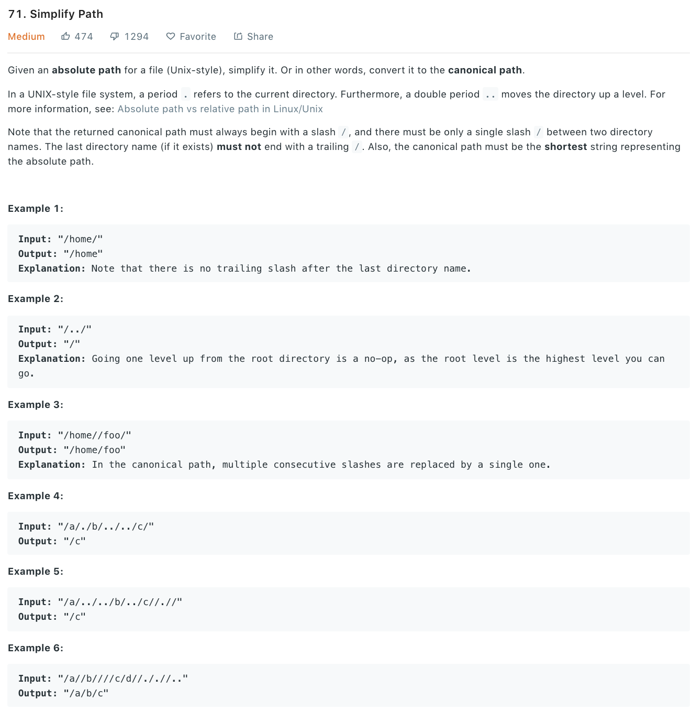

### Solution
Just need to handle different case.
```python
class Solution(object):
    def simplifyPath(self, path):
        """
        :type path: str
        :rtype: str
        """
        res = []
        elements = path.split("/")
        for element in elements:
            if element == '' or element == '.':
                continue
            # go to parent directory
            if element == '..':
                if res:
                    res.pop()
            else:
                res.append(element)
        
        return '/' + '/'.join(res)
```