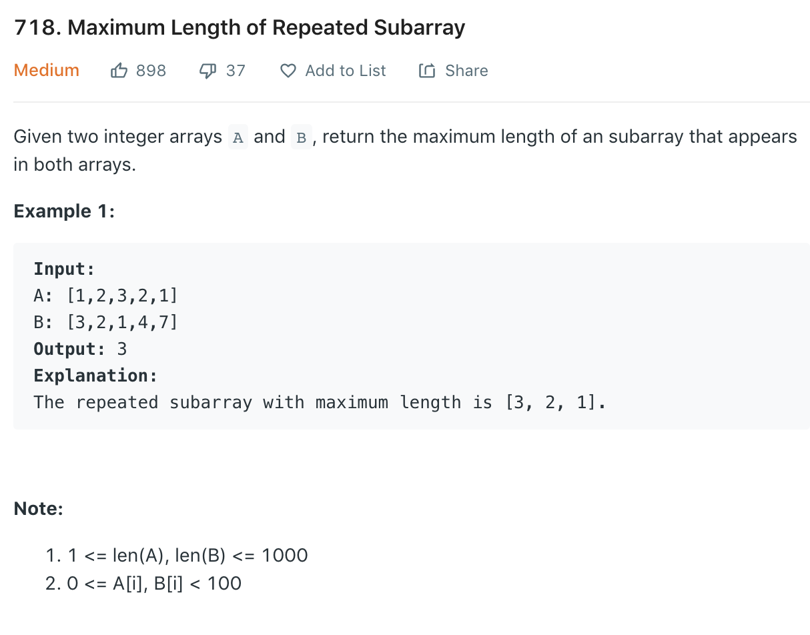

### Solution DP
`dp[i][j]` is the length of longest common subarray which ends at ith element in A and jth elemtn in B. Thus
```
if A[i-1] == B[j-1]:
    dp[i][j] = 1 + dp[i-1][j-1]
else:
    dp[i][j] = 0
```
```python
class Solution(object):
    def findLength(self, A, B):
        """
        :type A: List[int]
        :type B: List[int]
        :rtype: int
        """
        if not A or not B: return 0
        
        m, n = len(A), len(B)
        dp = [[0]*(m+1) for _ in range(n+1)]
        maxLen = 0
        
        for i in range(1, m+1):
            for j in range(1, n+1):
                if A[i-1] == B[j-1]:
                    dp[i][j] = 1 + dp[i-1][j-1]
                    maxLen = dp[i][j] if dp[i][j] > maxLen else maxLen
        
        return maxLen
```
- Space Optimization