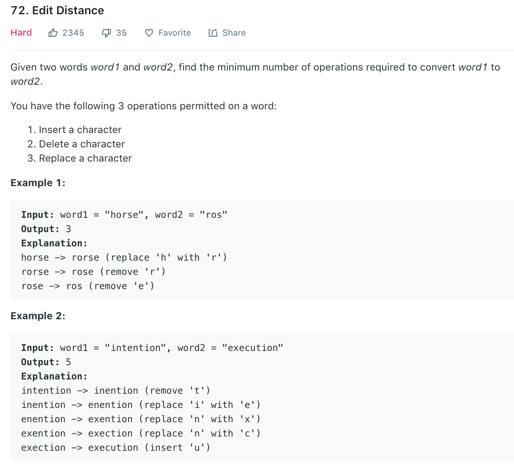
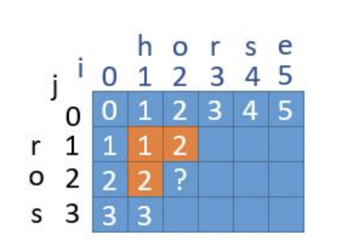

### Solution
As shown in 
dp[i][j] represents distance from word1[:i] to word2[:j].
```python
class Solution(object):
    def minDistance(self, word1, word2):
        """
        :type word1: str
        :type word2: str
        :rtype: int
        """
        n1, n2 = len(word1), len(word2)
        dp = [[0]*(n2 + 1) for _ in range(n1 + 1)]

        for i in range(n1 + 1):
            dp[i][0] = i
        for j in range(n2 + 1):
            dp[0][j] = j

        for i in range(1, n1 + 1):
            for j in range(1, n2 + 1):
                # If current digit is the same, distance is the same as dp[i-1][j-1]
                if word1[i - 1] == word2[j - 1]:
                    dp[i][j] = dp[i - 1][j - 1]
                # otherwise, we either replace, remove or insert one digit
                else:
                    dp[i][j] = min(dp[i - 1][j - 1], dp[i - 1][j], dp[i][j - 1]) + 1
        
        return dp[n1][n2]
```
Space optimization. To update dp[i][j], we need 3 value, dp[i-1][j], dp[i][j-1], dp[i-1][j-1]. So we need an array, as dp[i-1][j-1] is overwritten, another variable is needed.
```python
class Solution(object):
    def minDistance(self, word1, word2):
        n1, n2 = len(word1), len(word2)
        if n1 == 0: return n2
        if n2 == 0: return n1

        dp = [0] * (n2 + 1)
        for j in range(n2 + 1):
            dp[j] = j
        
        for i in range(1, n1 + 1):
            temp = dp[0]
            dp[0] += 1
            for j in range(1, n2 + 1):
                min_delete = min(dp[j], dp[j - 1]) + 1
                replace = temp
                if word1[i - 1] != word2[j - 1]:
                    replace += 1
                temp = dp[j]
                dp[j] = min(min_delete, replace)
        
        return dp[n2]
```