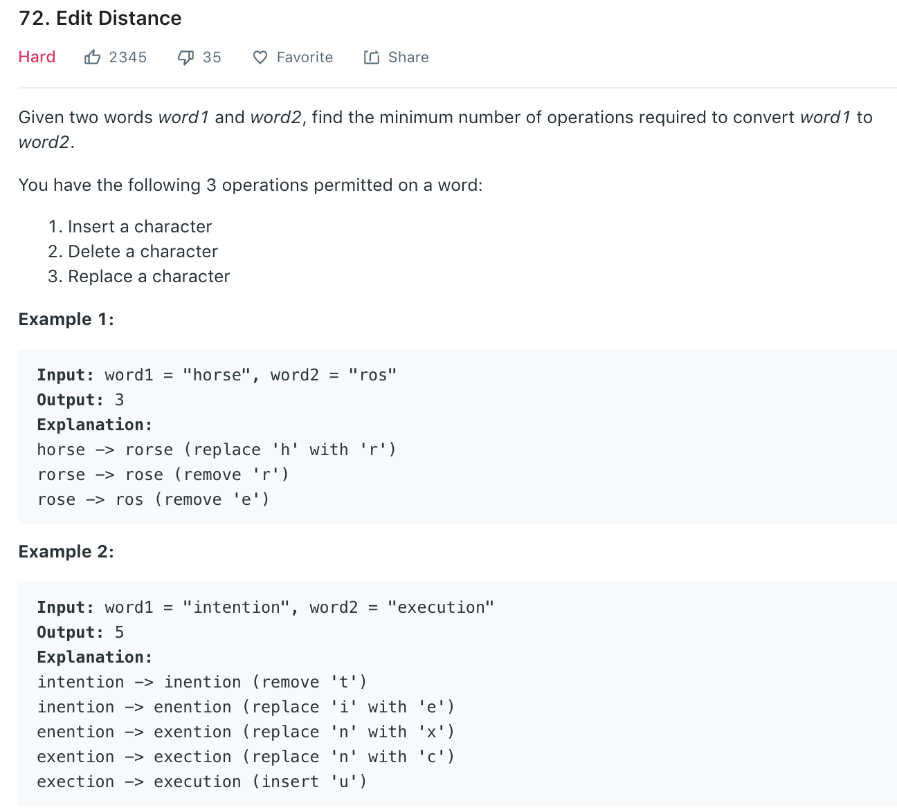
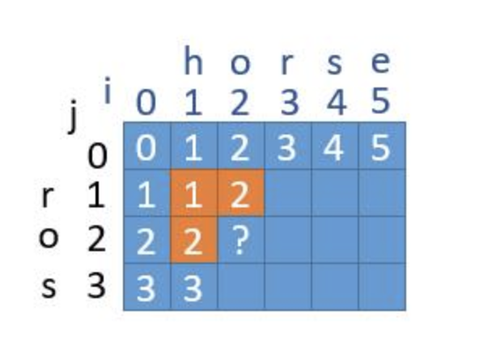

# Edit distance

### Solution
As shown in 
dp[i][j] represents distance from word1[:i] to word2[:j].
```python
class Solution(object):
    def minDistance(self, word1, word2):
        """
        :type word1: str
        :type word2: str
        :rtype: int
        """
        n1, n2 = len(word1), len(word2)
        # 初始化 dp 矩阵，多出一行一列用于处理空字符串的情况
        dp = [[0]*(n2 + 1) for _ in range(n1 + 1)]

        # 边界情况：把 word1 全部删掉或 word2 全靠插入得到
        for i in range(n1 + 1):
            dp[i][0] = i
        for j in range(n2 + 1):
            dp[0][j] = j

        for i in range(1, n1 + 1):
            for j in range(1, n2 + 1):
                # If current digit is the same, distance is the same as dp[i-1][j-1]
                if word1[i - 1] == word2[j - 1]:
                    dp[i][j] = dp[i - 1][j - 1]
                # otherwise, we either replace, remove or insert one digit
                else:
                    dp[i][j] = min(dp[i - 1][j - 1], dp[i - 1][j], dp[i][j - 1]) + 1
        
        return dp[n1][n2]
```
在 DP 矩阵中，计算 dp[i][j] 时依赖它左边、上边和左上角的三个邻居。
* 左上角 (dp[i-1][j-1])：它是“修改”的源头。如果你斜着走，意味着你正在通过替换（或跳过）来对齐字符。
* 左边 (dp[i][j-1])：它是“插入”的源头。你已经对齐了 word1 的前 i 个，但 word2 还多出一个，所以必须插入。
* 上边 (dp[i-1][j])：它是“删除”的源头。word1 的前 i 个太多了，对齐 word2 的前 j 个后还剩一个，所以必须删除。

Space optimization. To update dp[i][j], we need 3 value, dp[i-1][j], dp[i][j-1], dp[i-1][j-1]. So we need an array, as dp[i-1][j-1] is overwritten, another variable is needed.
```python
class Solution(object):
    def minDistance(self, word1, word2):
        n1, n2 = len(word1), len(word2)
        if n1 == 0: return n2
        if n2 == 0: return n1

        dp = [0] * (n2 + 1)
        for j in range(n2 + 1):
            dp[j] = j
        
        for i in range(1, n1 + 1):
            temp = dp[0]
            dp[0] += 1
            for j in range(1, n2 + 1):
                min_delete = min(dp[j], dp[j - 1]) + 1
                replace = temp
                if word1[i - 1] != word2[j - 1]:
                    replace += 1
                temp = dp[j]
                dp[j] = min(min_delete, replace)
        
        return dp[n2]
```
or
```python
class Solution:
    def minDistance(self, word1: str, word2: str) -> int:
        m, n = len(word1), len(word2)
        # 始终让 n 为较短的那个字符串长度，进一步节省空间
        if m < n: return self.minDistance(word2, word1)
        
        # 初始状态：word1 为空时，转换成 word2[0...j] 需要 j 次插入
        dp = list(range(n + 1))
        
        for i in range(1, m + 1):
            # 必须先取pre再更新dp[0]
            pre = dp[0]  # 这里的 pre 相当于 dp[i-1][j-1]（左上角）
            dp[0] = i    # 这里的 dp[0] 相当于 dp[i][0]（每行开头的删除操作）
            
            for j in range(1, n + 1):
                temp = dp[j] # 暂存还没更新的 dp[j]，它将成为下一个 j 的“左上角”
                if word1[i-1] == word2[j-1]:
                    dp[j] = pre
                else:
                    # min(左上角, 左边, 上边)
                    # pre: 左上角, dp[j-1]: 左边, dp[j]: 上边
                    dp[j] = min(pre, dp[j-1], dp[j]) + 1
                pre = temp # 更新 pre，供下一列使用
                
        return dp[n]
```