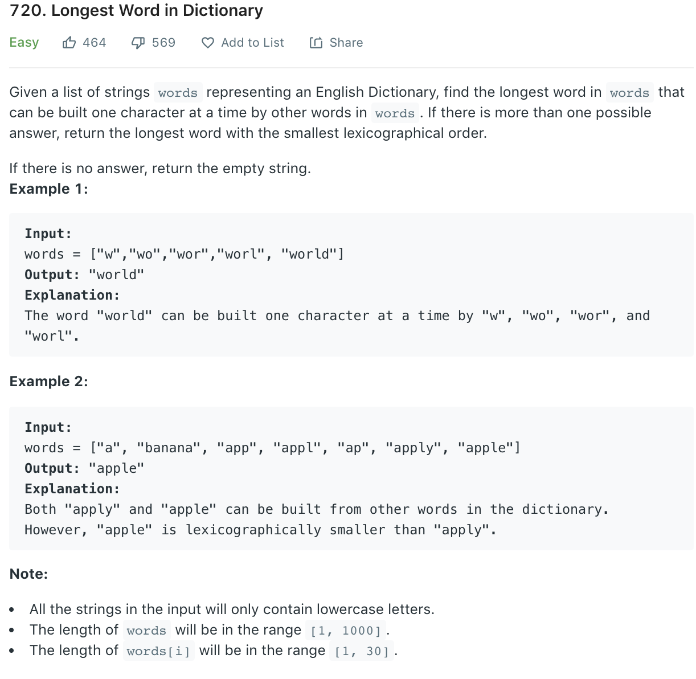

### Solution
```python
class Solution(object):
    def longestWord(self, words):
        """
        :type words: List[str]
        :rtype: str
        """
        valid = set([""])
        # words.sort(key=lambda x: len(x))
        words.sort(key=len)
        # for word in sorted(words, key=lambda x: len(x)):
        for word in words:
            if word[:-1] in valid:
                valid.add(word)

        v = sorted(valid)
        return max(v, key=lambda x: len(x))
        # return max(sorted(valid), key=lambda x: len(x))

W = ["a", "banana", "app", "appl", "ap", "apply", "apple"]
print(Solution().longestWord(W))
```