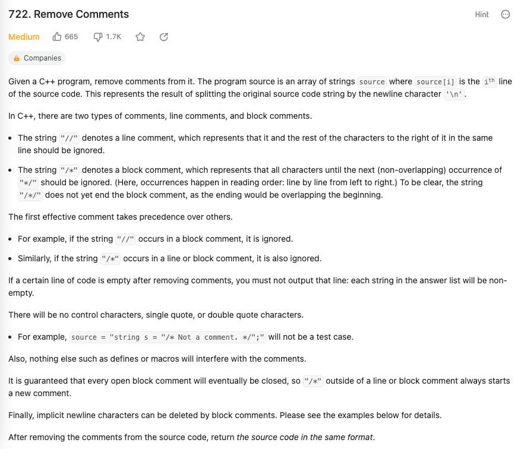

## Solution
```python
"""
There are many parsing/compiler type questions in LeetCode, and here are some tips on handling them:

Use a pointer to read each character so that you can skip characters if the current token is made by more than one character, such as //, /* and */.
For Python, use a while loop. You can't skip characters if you used for i in range(...) unlike in C++ or Java where you can have control of how you want to increment i at the end of each loop."""
#note use of buffer, otherwise need to mark at which line, which character block_comment_open started
def removeComments(source: List[str]) -> List[str]:
    res, buffer, block_comment_open = [], '', False
    for line in source:
        #for i in range(len(line)):
        #    if blockStart < 0:
        #        if line[i] == '/' and i < len(line)-1 and line[i+1] == '/':
        #            res.append(line[:i])
        #            break
        #        if i == len(line)-1:
        #            res.append(line)
        #    else
        i = 0
        while i < len(line):
            char = line[i]
            if char == '/' and i < len(line)-1 and line[i+1] == '/' and not block_comment_open:
                i = len(line) #break
            elif char == '/' and i < len(line)-1 and line[i+1] == '*' and not block_comment_open:
                block_comment_open = True
                i += 1
            elif char == '*' and i < len(line)-1 and line[i+1] == '/' and block_comment_open:
                block_comment_open = False
                i += 1
            elif not block_comment_open:
                buffer += char
            i += 1
        if buffer and not block_comment_open:
            res.append(buffer)
            buffer = ''
        return res
```