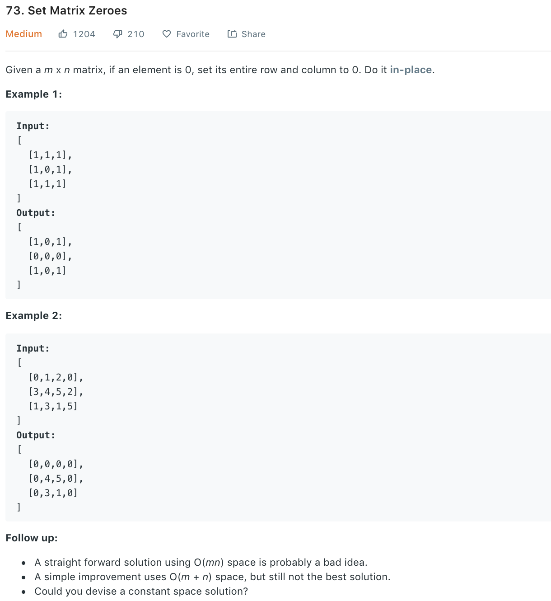

### Solution 1
Refer to [here](https://leetcode.com/problems/set-matrix-zeroes/solution/).
```python
class Solution(object):
    def setZeroes(self, matrix):
        """
        :type matrix: List[List[int]]
        :rtype: None Do not return anything, modify matrix in-place instead.
        """
        RowSet, ColSet = set(), set()
        # Store rows and cols of zero element
        for i in range(len(matrix)):
            for j in range(len(matrix[0])):
                if matrix[i][j] == 0:
                    RowSet.add(i)
                    ColSet.add(j)
        # Set to zero
        for i in range(len(matrix)):
            for j in range(len(matrix[0])):
                if i in RowSet or j in ColSet:
                    matrix[i][j] = 0
```
+ Time complexity: O(mn)
+ Space complexity: O(m+n)
### Solution 2
Refer to [here](https://leetcode.com/problems/set-matrix-zeroes/solution/).
User the first row and col of original matrix to indicate whether row/col should be set to zero.
Note when setting indicating values we start from col 1: consider [[1,1,1],[0,1,2]]
```python
        firstColZero = False
        R, C = len(matrix), len(matrix[0])
        for i in range(R):
            if matrix[i][0] == 0:
                firstColZero = True
            for j in range(1, C):
                if matrix[i][j] == 0:
                    matrix[i][0] = 0
                    matrix[0][j] = 0

        for i in range(1, R):
            for j in range(1, C):
                if matrix[i][0] == 0 or matrix[0][j] == 0:
                    matrix[i][j] = 0

        if matrix[0][0] == 0:
            for j in range(C):
                matrix[0][j] = 0

        if firstColZero:
            for i in range(R):
                matrix[i][0] = 0
```