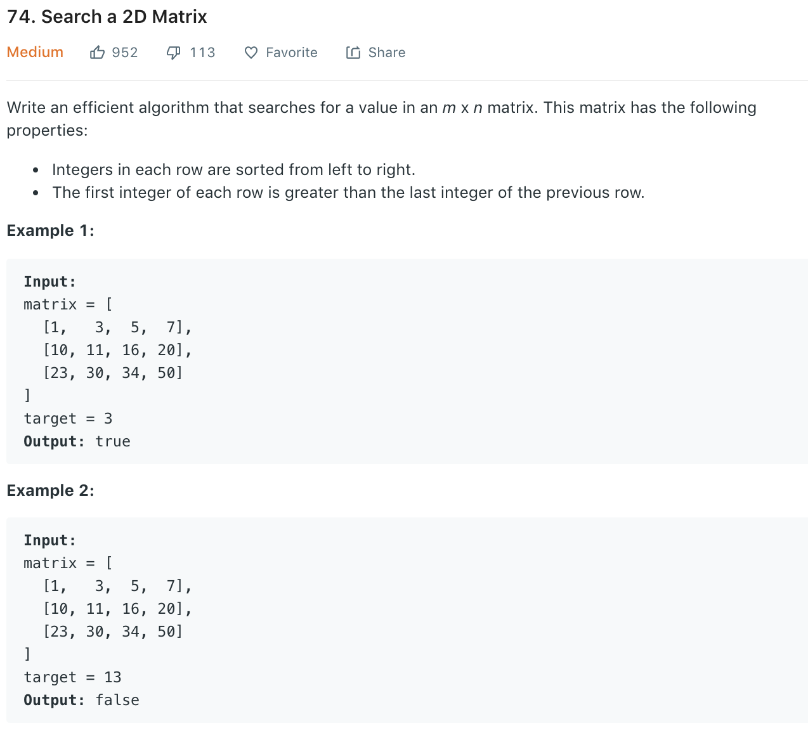

### Solution 1
Due to nature of the matrix, we start from bottom left, if current value is smaller than target, we can only go right (as go up will make value even smaller); if greater, go up.
```python
class Solution(object):
    def searchMatrix(self, matrix, target):
        """
        :type matrix: List[List[int]]
        :type target: int
        :rtype: bool
        """
        if not matrix or not[matrix[0]]: return False
        row, col = len(matrix), len(matrix[0])
        
        i, j = row - 1, 0
        while 0 <= i < row and 0 <= j < col:
            if matrix[i][j] == target:
                return True
            if matrix[i][j] < target:
                j += 1
            else:
                i -= 1

        return False
```
+ Time complexity: O(n+m)
+ Space complexity: O(1)
### Solution 2
If we put the matrix row by row, it's just like an ordered array. Similarly, we can do binary search.
```python
class Solution(object):
    def searchMatrix(self, matrix, target):
        if not matrix or not[matrix[0]]: return False
        row, col = len(matrix), len(matrix[0])
        lo, hi = 0, row * col - 1
        while lo <= hi:
            mid = lo + (hi - lo) // 2
            val = matrix[mid // col][mid % col]
            if val < target:
                lo = mid + 1
            elif val > target:
                hi = mid - 1
            else:
                return True
        
        return False
    # slightly different binary search
    def searchMatrix2(self, matrix, target):
        if not matrix or not matrix[0]: return False
        n, m = len(matrix), len(matrix[0])
        l, r = 0, n * m - 1
        while l < r:
            mid = (l + r) >> 1
            if matrix[mid // m][mid % m] < target:
                l = mid + 1
            else:
                r = mid
        return matrix[r // m][r % m] == target
```