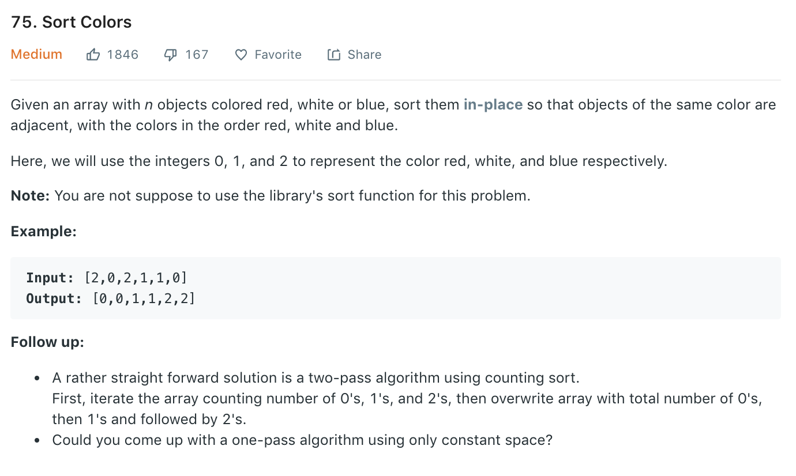

### Solution 1 two pass
A naive way as shown in follow up is to first count appearing numbers of 0, 1 (the rest would be 2), then iterate the array and modify accordingly.
```python
class Solution(object):
    def sortColors(self, nums):
        zeroCount, oneCount = 0, 0
        for num in nums:
            if num == 0:
                zeroCount += 1
            elif num == 1:
                oneCount += 1
        
        for i in range(len(nums)):
            if zeroCount > 0:
                nums[i] = 0
                zeroCount -= 1
            elif oneCount > 0:
                nums[i] = 1
                oneCount -= 1
            else:
                nums[i] = 2
```
### Solution one pass
Refer to [here](https://leetcode.com/problems/sort-colors/discuss/26500/Four-different-solutions). We use n0, n1, n2 to represent the end of ordered 0, 1 and 2.
```
0  0  1  2  2  2  0  2  1
   ^  ^        ^  ^
  n0 n1       n2  i

```
If current position i points to 0, we need to move forward n2 (set element to 2), n1 (add another 1) and n0(add another 0). As adding one 0 will overwrite one 1, append one 1 will hence overwrite one 2.
```
0  0  1  2  2  2  2  2  1  n2++
   ^  ^           ^  
   n0 n1          i
                  n2  

0  0  1  1  2  2  2  2  1  n1++
   ^     ^        ^  
   n0    n1       i
                  n2                   

0  0  0  1  2  2  2  2  1  n0++
      ^  ^        ^  
      n0 n1       i
                  n2

```
```python
class Solution(object):
    def sortColors(self, nums):
        """
        :type nums: List[int]
        :rtype: None Do not return anything, modify nums in-place instead.
        """
        zeroEnd, oneEnd, twoEnd = -1, -1, -1
        for num in nums:
            twoEnd += 1
            nums[twoEnd] = 2
            if num != 2:
                oneEnd += 1
                nums[oneEnd] = 1
            if num == 0:
                zeroEnd += 1
                nums[zeroEnd] = 0
``` 
Another way is to use 2 pointers-all before Zero pointer should be 0; all after Two pointer should be 2.
```python
class Solution(object):
    def sortColors(self, nums):
        zeroPos = 0
        twoPos = len(nums) - 1
        i = 0
        while i <= twoPos:
            if nums[i] == 0:
                temp = nums[zeroPos]
                nums[zeroPos] = 0
                nums[i] = temp
                zeroPos += 1
            elif nums[i] == 2:
                temp = nums[twoPos]
                nums[twoPos] = 2
                nums[i] = temp
                twoPos -= 1
                i -= 1
            i += 1
```