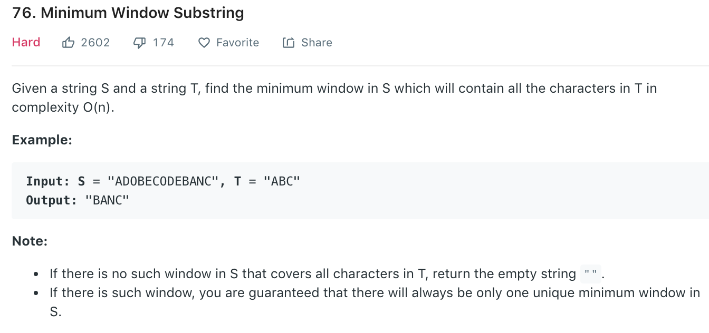

# Minimum window substring

### Solution
Refer to [here](https://leetcode.com/problems/minimum-window-substring/solution/) and [here](https://leetcode.com/problems/minimum-window-substring/discuss/26835/Java-4ms-bit-97.6).
Sliding window.
```python
class Solution(object):
    def minWindow(self, s, t):
        """
        :type s: str
        :type t: str
        :rtype: str
        """
        if not s or len(s) < len(t): return ""

        # use Use ascii in array as index to represent number of each character. (we can also use a hashmap)
        map = [0] * 128
        for i in t:
            map[ord(i)] += 1
        
        left = 0
        minLeft = 0
        minLen = len(s) + 1
        matched = 0

        for right in range(len(s)):
            if s[right] in t:
                map[ord(s[right])] -= 1
                if map[ord(s[right])] >= 0:
                    matched += 1
            
            while matched == len(t):
                curLen = right - left + 1
                if curLen < minLen:
                    minLen = curLen
                    minLeft = left
                if s[left] in t:
                    map[ord(s[left])] += 1
                    if map[ord(s[left])] > 0:
                        matched -= 1
                left += 1
        
        if minLen > len(s):
            return ""
        
        return s[minLeft: minLeft + minLen]

```
We want the smallest window in s that contains all characters of t (with the right counts).
Instead of checking all substrings, we use a sliding window:

Expand the window by moving the right pointer r and adding characters into a window map.
Once the window has all required characters (i.e., it "covers" t), we try to shrink it from the left with pointer l to make it as small as possible while still valid.
During this process, we keep track of the best (smallest) window seen so far.
This way, we only scan each character at most two times, making it efficient and still easy to follow.
Time: O(n+m), Space: O(m)
n is length of s and m is total number of uniuque characters in strings t and s
```python
class Solution:
    def minWindow(self, s: str, t: str) -> str:
        if t == "" or len(s) < len(t):
            return ""
        countT = {}
        for c in t:
            countT[c] = countT.get(c, 0) + 1

        minLeft = 0
        minLen = len(s) + 1
        matched = 0
        need = len(countT) # number of unique chars in t

        l = 0
        window = {}
        for r in range(len(s)):
            c = s[r]
            window[c] = window.get(c, 0) + 1
            if c in countT and window[c] == countT[c]:
                matched += 1

            while matched == need:
                if (r - l + 1) < minLen:
                    minLen = r - l + 1
                    minLeft = l
                
                # shrink window
                window[s[l]] -= 1 # s[l] removed from window
                if s[l] in countT and window[s[l]] < countT[s[l]]: # s[l] count drops below expected
                    matched -= 1
                l += 1
        
        if minLen > len(s): return ""
        return s[minLeft: minLeft+minLen]
```