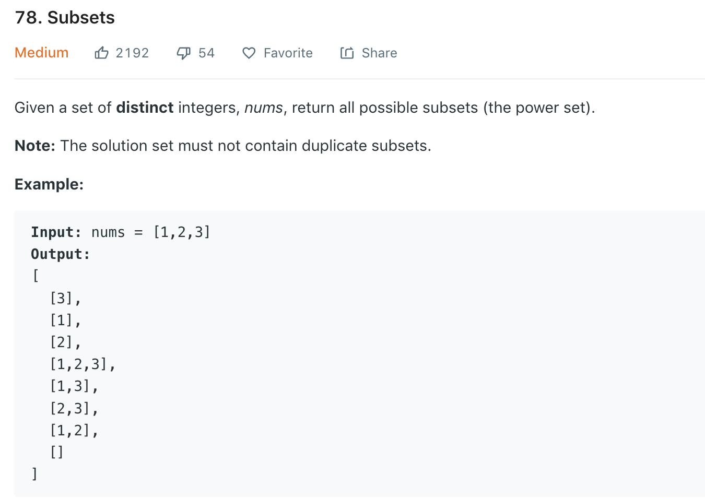

### Solution 1 backtracing
We traverse nums and have two options at each number: whether add it or not.
```python
class Solution(object):
    def subsets(self, nums):
        """
        :type nums: List[int]
        :rtype: List[List[int]]
        """
        ret = []
        def dfs(ptr, path):
            if ptr == len(nums):
                ret.append(path)
                return
            self.dfs(ptr + 1, path)#do not add current num
            self.dfs(ptr + 1, path + [nums[ptr]])#add current num
        
        dfs(0, [])
        return ret
```
Another way
```python
class Solution(object):
    def subsets(self, nums):
        ret = []
        def dfs(ptr, path):
            if ptr == len(nums):
                # need a deep copy of path (value instead of reference). As we will restore path later 
                ret.append(path[::])

            dfs(ptr + 1, path)
            # instead of creating a new path, we modify the current path in-place
            path.append(nums[ptr])
            dfs(ptr + 1, path)
            # restore path to original value 
            path.remove(nums[ptr])
        
        dfs(0, [])
        return ret
```

### Solution 2
Refer to [here](https://leetcode.com/problems/subsets/discuss/27278/C%2B%2B-RecursiveIterativeBit-Manipulation).
```python
class Solution(object):
    def subsets(self, nums):
        ans = []
        def dfs(start, path):
            ans.append(path)
            for i in range(start, len(nums)):
                dfs(i + 1, path + [nums[i]])

        dfs(0, [])
        return ans
```

### Solution 3 Iteration
Using [1, 2, 3] as an example, the iterative process is like:<br>
Initially, one empty subset [[]]<br>
Adding 1 to []: [[], [1]];<br>
Adding 2 to [] and [1]: [[], [1], [2], [1, 2]];<br>
Adding 3 to [], [1], [2] and [1, 2]: [[], [1], [2], [1, 2], [3], [1, 3], [2, 3], [1, 2, 3]].
```python
class Solution(object):
    def subsets(self, nums):
        subs = [[]]
        # add number
        for num in nums:
            n = len(subs)
            # add to each of existing subsets
            for i in range(n):
                subs.append(subs[i] + [num])
        return subs
```

### Solution 4 Bit operation
Refer to [here](https://leetcode.com/problems/subsets/discuss/27288/My-solution-using-bit-manipulation)<br>
Each num is either in subset (use digit 1 to represent) or not in (digit 0). For ex we have [1, 2, 3], then subset [] -> 000, [3] -> 001, [1, 3] -> 101 etc. So we only need to travers 000 to 111, and add number to subset if the corresponding bit digit is 1.
```python
class Solution(object):
    def subsets(self, nums):
        ans = []
        bit_nums = len(nums)
        ans_nums = 1 << bit_nums #2^n
        for i in range(ans_nums):
            tmp = []
            count = 0 #digit in nums
            i_copy = i #shift
            while i_copy != 0:
                if (i_copy & 1) == 1:#if cur digit is 1
                    tmp.append(nums[count])
                count += 1
                i_copy = i_copy >> 1 #move to right
            ans.append(tmp)
        return ans
```