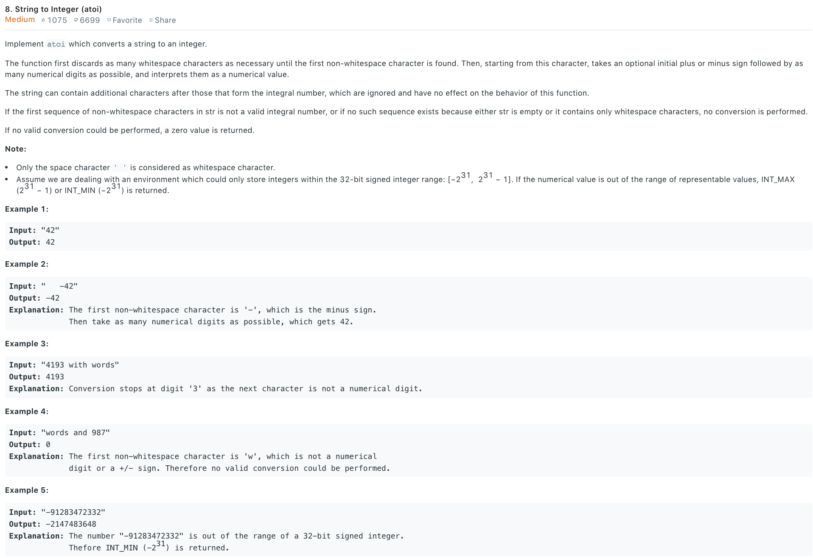

### Solution
```python
class Solution(object):
    def myAtoi(self, str):
        """
        :type str: str
        :rtype: int
        """
        sign, base, i = 1, 0, 0
        # INT_MAX = pow(2, 31)-1
        INT_MAX = (1 << 31) - 1
        # 1. discarding all leading whitespaces
        while str[i] == ' ':
            i += 1
        # 2. sign of the num
        if str[i] == '-' or str[i] == '+':
            sign = 1 - 2 * (str[i] == '-')
            i += 1
        #     3.4. overflow and invalid input
        while  i < len(str) and '0' <= str[i] <= '9':
            if base > INT_MAX or (base == INT_MAX / 10 and ord(str[i]) - ord('0') > 7):
                return INT_MAX if sign == 1 else -INT_MAX-1
            base = 10 * base + ord(str[i]) - ord('0')
            i += 1
        # or simply
        # return min(max(num * sign, -1 << 31), (1 << 31) - 1)
        return base * sign
```