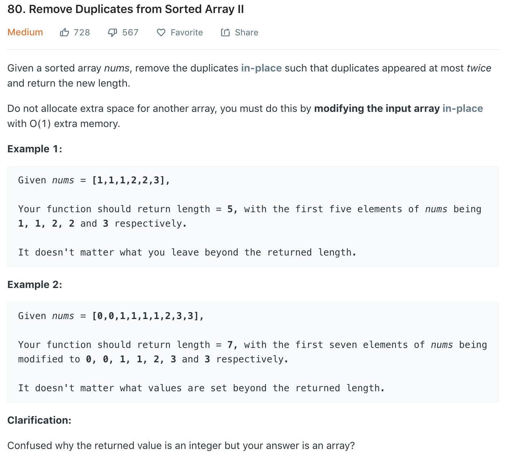

Similar to [26](26.md)
### Solution 1
```python
class Solution(object):
    def removeDuplicates(self, nums):
        """
        :type nums: List[int]
        :rtype: int
        """
        i = 0
        for num in nums:
        # check if current num has occured more than twice
            if i < 2 or num > nums[i - 2]:
                nums[i] = num
                i += 1
        return i
```
### Solution 2
i (slow pointer) points to the end of the array we want, j (fast) iterates through nums. Use count to record how many times current number has occured in case exceed 2.
```python
class Solution(object):
    def removeDuplicates(self, nums):
        if len(nums) < 3:
            return len(nums)
        count = 1
        maxCount = 2
        i = 0
        for j in range(1, len(nums)):
        # If current number is different from end of slow pointer, add it to slow pointer
            if nums[j] != nums[i]:
                i += 1
                nums[i] = nums[j]
                count = 1
            # same number, check if it has occured more than twice
            elif count < maxCount:
                i += 1
                nums[i] = nums[j]
                count += 1
        return i + 1
```
+ Time complexity: O(n)
+ Space complexity: O(1)