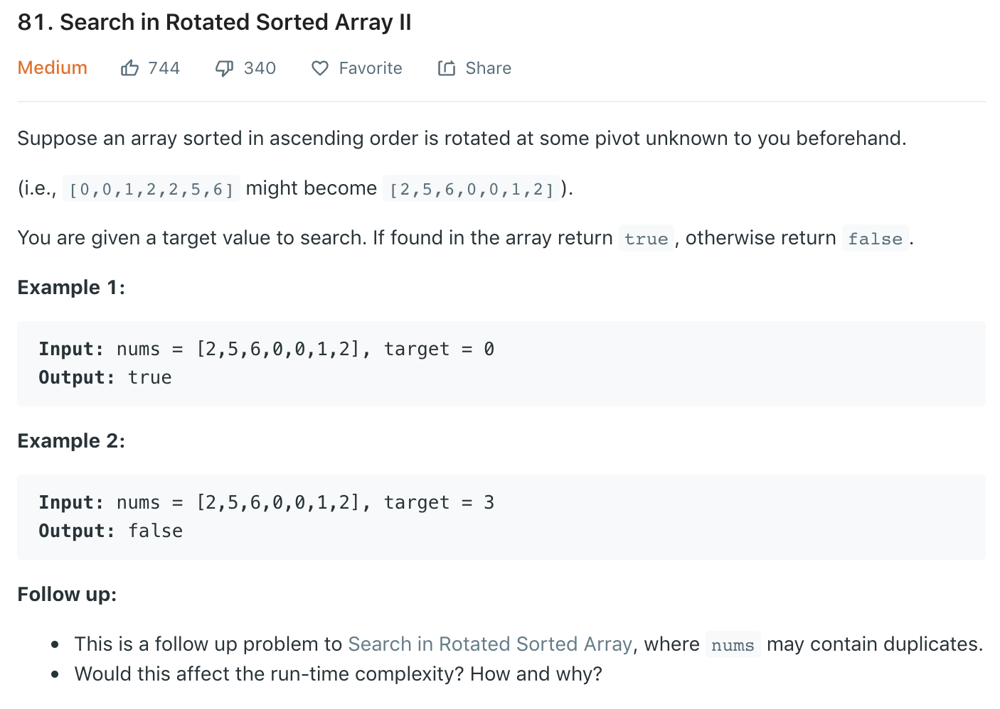

Based on [33](33.md). However, solution 2 in 33 failed on test case [1 3 1 1 1 ], 3. The reason is that when nums[start] <= nums[mid], we think the left side is ordered, however, due to duplicate 1, nums[start] = nums[mid], but left side [1 3 1] is unordered.<br>
We need to consider nums[start] == nums[mid] separately, refer to [here](https://leetcode.com/problems/search-in-rotated-sorted-array-ii/discuss/28218/My-8ms-C%2B%2B-solution-(o(logn). Just let start++ when equal.
### Solution
```python
class Solution(object):
    def search(self, nums, target):
        """
        :type nums: List[int]
        :type target: int
        :rtype: bool
        """
        start, end = 0, len(nums) - 1
        while start <= end:
            mid = (start + end) // 2
            if nums[mid] == target: return True

            # >>>Diff>>>
            if nums[start] < nums[mid]:
                if nums[start] <= target < nums[mid]:
                    end = mid - 1
                else:
                    start = mid + 1
            # >>>
            elif nums[start] == nums[mid]:
                start += 1
            # <<<
            else:
                if nums[mid] < target <= nums[end]:
                    start = mid + 1
                else:
                    end = mid - 1
        
        return False
```