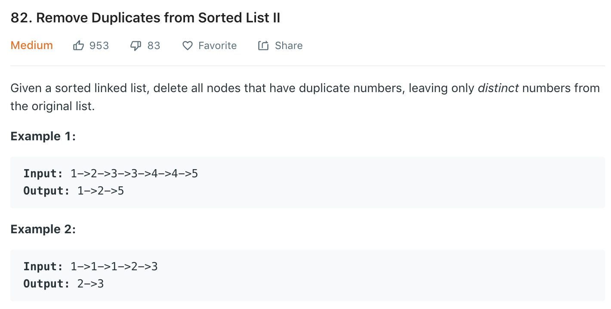

### Solution 1 Iteration
```python
class Solution(object):
    def deleteDuplicates(self, head):
        """
        :type head: ListNode
        :rtype: ListNode
        """
        if not head or not head.next:
            return head
        dummy = ListNode(-1)
        dummy.next = head
        pre = dummy
        cur = head

        while cur:
            while cur.next and cur.val == cur.next.val:
                cur = cur.next
            if pre.next is cur:
                pre = pre.next
            else:
                pre.next = cur.next
            cur = cur.next
        
        return dummy.next
```

```python
class Solution(object):
    def deleteDuplicates(self, head):
        """
        :type head: ListNode
        :rtype: ListNode
        """
        if not head or not head.next:
            return head
        dummy = ListNode(-1)
        dummy.next = head
        pre = dummy
        cur = head

        while cur: 
            if cur.next and cur.val == cur.next.val:#<- faster than above
                cur = cur.next
            else:
                if pre.next is cur:
                    pre = pre.next
                else:
                    pre.next = cur.next
                cur = cur.next
        
        return dummy.next
```
### Solution 2 Recusion
```python
class Solution(object):
    def deleteDuplicates(self, head):
        if not head:
            return None
        if head.next and head.val == head.next.val:
            while head.next and head.next.val == head.val:
                head = head.next
            return self.deleteDuplicates(head.next)
        else:
            head.next = self.deleteDuplicates(head.next)
        return head
```