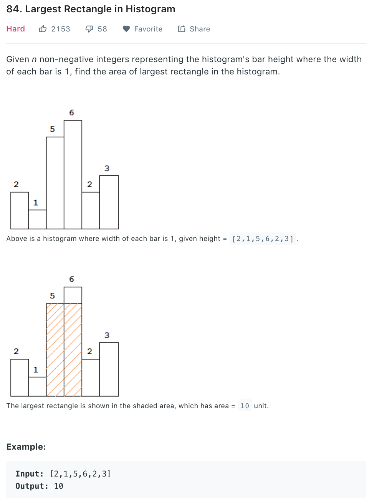

### Solution 1 Brutal force
+ Iterate through all bars
```python
class Solution(object):
    def largestRectangleArea(self, heights):
        """
        :type heights: List[int]
        :rtype: int
        """
        if not heights:
            return 0
        maxArea = 0
        for i in range(len(heights)):
            h = heights[i]
            # l, r is the position of the nearest left bar and right bar that's shorter than current bar
            l, r = i - 1, i + 1
            while l >= 0 and heights[l] >= h:
                l -= 1
            while r < len(heights) and heights[r] >= h:
                r += 1
            area = h * (r - l - 1)
            maxArea = area if area > maxArea else maxArea
        return maxArea
```
+ Time complexity: O(n^2)
### Solution 2 DP
Based on Solution 1, we use an array *lessFromLeft[]* to store the position of the first bar that's shorter than current bar to the left. Note when current bar i is shorter than previous one i-1, instead of i-1, we can jump directly to lessFromLeft[i-1] as all bars from lessFromLeft[i-1]+1 to i-1 is taller than current bar i. 
+ Snippets for finding lessFromLeft
```python
lessFromLeft = [0] * (len(heights)+1)
lessFromLeft[0] = -1
for i in range(1, len(heights)):
    l = i - 1
    while l >= 0 and heights[l] >= heights[i]:
        l = lessFromLeft[l]
    lessFromLeft[i] = l
```
+ Full solution
```python
class Solution(object):
    def largestRectangleArea(self, heights):
        if not heights:
            return 0

        maxArea = 0
        n = len(heights)
        lessFromLeft = [0] * n #stores the pos of the first height shorter than cur to its left
        lessFromRight = [0] * n
        lessFromLeft[0] = -1
        lessFromRight[-1] = n

        for i in range(1, n):
            p = i - 1 # starting from i - 1 not i
            while p >= 0 and heights[p] >= heights[i]:
                p = lessFromLeft[p]
            lessFromLeft[i] = p

        for i in reversed(range(n - 1)):
            p = i + 1
            while p < n and heights[p] >= heights[i]:
                p = lessFromRight[p]
            lessFromRight[i] = p

        for i in range(n):
            area = heights[i] * (lessFromRight[i] - lessFromLeft[i] - 1)
            maxArea = max(area, maxArea)

        return maxArea
```
Time complexity: O(n), depending on finding lessFromLeft[i]<br>
Space complexity: O(n), storing the position of the first bar shorter than current one to left and right.

### Solution 3 Stack
Refer to [here](https://www.geeksforgeeks.org/largest-rectangle-under-histogram/).<br>
Same idea as solution 2, just need to pair up the left and right bar.
```python
class Solution(object):
    def largestRectangleArea(self, histogram):
        # Create an empty stack. The stack holds indexes of histogram[] list.
        # The bars stored in the stack are always in increasing order of their heights.
        stack = list()
        max_area = 0  # Initalize max area

        # Run through all bars of given histogram
        index = 0
        while index < len(histogram):
            # If this bar is higher than the bar on top stack, push it to stack
            if (not stack) or (histogram[stack[-1]] <= histogram[index]):
                stack.append(index)
                index += 1
            # If this bar is lower than top of stack, then calculate area of rectangle with
            # stack top as the smallest (or minimum height) bar.'i' is 'right index' for
            # the top and element before top in stack is 'left index'
            else:
                # pop the top
                top_of_stack = stack.pop()
                # Calculate the area with histogram[top_of_stack] stack as smallest bar
                area = (histogram[top_of_stack] *
                        ((index - stack[-1] - 1)
                         if stack else index))
                # update max area, if needed
                max_area = max(max_area, area)
        # Now pop the remaining bars from stack and calculate area with
        # every popped bar as the smallest bar
        while stack:
            # pop the top
            top_of_stack = stack.pop()
            # Calculate the area with histogram[top_of_stack] stack as smallest bar
            area = (histogram[top_of_stack] *
                    ((index - stack[-1] - 1)
                     if stack else index))
            # update max area, if needed
            max_area = max(max_area, area)
            # Return maximum area under the given histogram
        return max_area
```
+ Time complexity: O(n) Each bar will only be pushed and popped out of stack, twice
+ Space complexity: O(n) size of stack
### Solution 4
Refer to [here](https://leetcode.com/problems/largest-rectangle-in-histogram/discuss/28910/Simple-Divide-and-Conquer-AC-solution-without-Segment-Tree).
```python
class Solution(object):
    def largestRectangleArea(self, histogram):
        if len(heights) == 0: return 0
        return self.getMaxArea(heights, 0, len(heights) - 1)

    def getMaxArea(self, heights, left, right):
        if left == right:
            return heights[left]
        mid = left + (right - left) // 2
        areaL = self.getMaxArea(heights, left, mid)
        areaR = self.getMaxArea(heights, mid + 1, right)
        areaM = self.getMidArea(heights, left, mid, right)
        return max(areaL, areaR, areaM)

    def getMidArea(self, heights, left, mid, right):
        i, j = mid, mid + 1
        minH = min(heights[i], heights[j])
        area = minH * 2

        # expand to two sides
        while i >= left and j <= right:
            minH = min(minH, min(heights[i], heights[j]))
            # update max area
            area = max(area, minH * (j - i + 1))
            if i == left:
                j += 1
            elif j == right:
                i -= 1
            #     choose higher bar
            elif heights[i - 1] >= heights[j + 1]:
                i -= 1
            else:
                j += 1

        return area
```