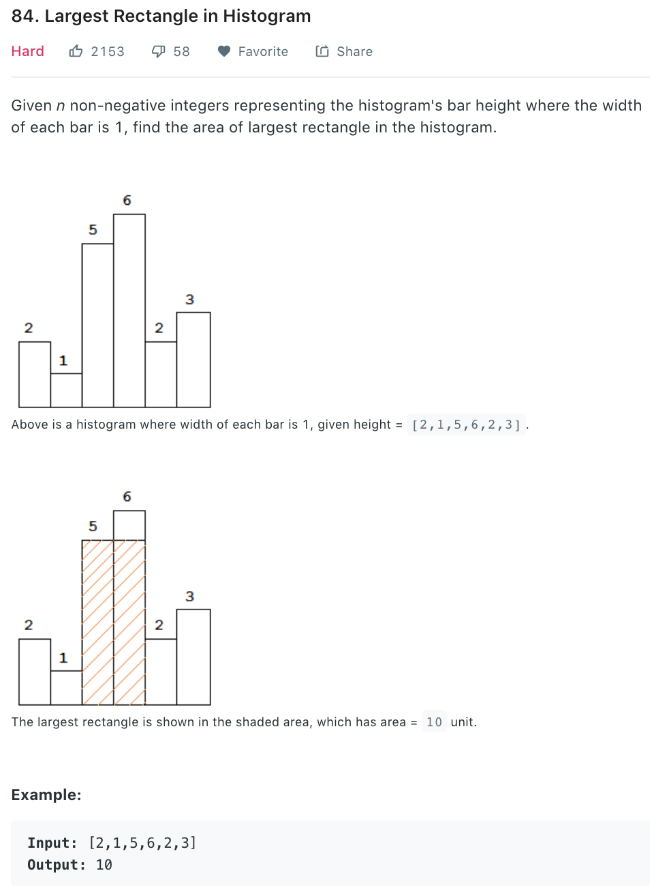

### Solution 1 Brutal force
+ Iterate through all bars
```python
class Solution(object):
    def largestRectangleArea(self, heights):
        """
        :type heights: List[int]
        :rtype: int
        """
        if not heights:
            return 0
        maxArea = 0
        for i in range(len(heights)):
            h = heights[i]
            # l, r is the position of the nearest left bar and right bar that's shorter than current bar
            l, r = i - 1, i + 1
            while l >= 0 and heights[l] >= h:
                l -= 1
            while r < len(heights) and heights[r] >= h:
                r += 1
            area = h * (r - l - 1)
            maxArea = area if area > maxArea else maxArea
        return maxArea
```
+ Time complexity: O(n^2)
### Solution 2 DP
Based on Solution 1, we use an array *lessFromLeft[]* to store the position of the first bar that's shorter than current bar to the left. Note when current bar i is shorter than previous one i-1, instead of i-1, we can jump directly to lessFromLeft[i-1] as all bars from lessFromLeft[i-1]+1 to i-1 is taller than current bar i. 
+ Snippets for finding lessFromLeft
```python
lessFromLeft = [0] * (len(heights)+1)
lessFromLeft[0] = -1
for i in range(1, len(heights)):
    l = i - 1
    while l >= 0 and heights[l] >= heights[i]:
        l = lessFromLeft[l]
    lessFromLeft[i] = l
```
+ Full solution
```python
class Solution(object):
    def largestRectangleArea(self, heights):
        if not heights:
            return 0

        maxArea = 0
        n = len(heights)
        lessFromLeft = [0] * n #stores the pos of the first height shorter than cur to its left
        lessFromRight = [0] * n
        lessFromLeft[0] = -1
        lessFromRight[-1] = n

        for i in range(1, n):
            p = i - 1 # starting from i - 1 not i
            while p >= 0 and heights[p] >= heights[i]:
                p = lessFromLeft[p]
            lessFromLeft[i] = p

        for i in reversed(range(n - 1)):
            p = i + 1
            while p < n and heights[p] >= heights[i]:
                p = lessFromRight[p]
            lessFromRight[i] = p

        for i in range(n):
            area = heights[i] * (lessFromRight[i] - lessFromLeft[i] - 1)
            maxArea = max(area, maxArea)

        return maxArea
```
Time complexity: O(n), depending on finding lessFromLeft[i]<br>
Space complexity: O(n), storing the position of the first bar shorter than current one to left and right.

### Solution 3 Stack
Refer to [here](https://www.geeksforgeeks.org/largest-rectangle-under-histogram/).<br>
Same idea as solution 2, just need to pair up the left and right bar.
```python
class Solution(object):
    def largestRectangleArea(self, histogram):
        # Create an empty stack. The stack holds indexes of histogram[] list.
        # The bars stored in the stack are always in increasing order of their heights.
        stack = list()
        max_area = 0  # Initalize max area

        # Run through all bars of given histogram
        index = 0
        while index < len(histogram):
            # If this bar is higher than the bar on top stack, push it to stack
            if (not stack) or (histogram[stack[-1]] <= histogram[index]):
                stack.append(index)
                index += 1
            # If this bar is lower than top of stack, then calculate area of rectangle with
            # stack top as the smallest (or minimum height) bar.'i' is 'right index' for
            # the top and element before top in stack is 'left index'
            else:
                # pop the top
                top_of_stack = stack.pop()
                # Calculate the area with histogram[top_of_stack] stack as smallest bar
                area = (histogram[top_of_stack] *
                        ((index - stack[-1] - 1)
                         if stack else index))
                # update max area, if needed
                max_area = max(max_area, area)
        # Now pop the remaining bars from stack and calculate area with
        # every popped bar as the smallest bar
        while stack:
            # pop the top
            top_of_stack = stack.pop()
            # Calculate the area with histogram[top_of_stack] stack as smallest bar
            area = (histogram[top_of_stack] *
                    ((index - stack[-1] - 1)
                     if stack else index))
            # update max area, if needed
            max_area = max(max_area, area)
            # Return maximum area under the given histogram
        return max_area
```
+ Time complexity: O(n) Each bar will only be pushed and popped out of stack, twice
+ Space complexity: O(n) size of stack

3.1
For each bar, we want to know how far it can stretch left and right before bumping into a shorter bar.
That distance tells us the widest rectangle where this bar is the limiting height.
To efficiently find the nearest smaller bar on both sides, we use a monotonic stack that keeps indices of bars in increasing height order.
This lets us compute boundaries in linear time instead of checking outward for every bar.

Algorithm
Use a stack to find, for each index i, the nearest smaller bar on the left:
If the current bar is shorter than the bar on top of the stack, pop until this is no longer true.
The top of the stack becomes the left boundary.
If the stack is empty, no smaller bar exists, so left boundary is -1.
Repeat the same process from right to left to find the nearest smaller bar on the right:
If no smaller bar exists, the right boundary is n.
For each bar:
Expand between the boundaries and compute its max rectangle:
height[i] * (right - left - 1)
Return the largest area found.
```python
class Solution:
    def largestRectangleArea(self, heights: List[int]) -> int:
        n = len(heights)
        stack = []

        leftMost = [-1] * n
        for i in range(n):
            while stack and heights[stack[-1]] >= heights[i]:
                stack.pop()
            if stack:
                leftMost[i] = stack[-1]
            stack.append(i)

        stack = []
        rightMost = [n] * n
        for i in range(n - 1, -1, -1):
            while stack and heights[stack[-1]] >= heights[i]:
                stack.pop()
            if stack:
                rightMost[i] = stack[-1]
            stack.append(i)

        maxArea = 0
        for i in range(n):
            leftMost[i] += 1
            rightMost[i] -= 1
            maxArea = max(maxArea, heights[i] * (rightMost[i] - leftMost[i] + 1))
        return maxArea
```

3.2 stack one-pass
We want, for each bar, the widest area where it can act as the shortest bar.
With a single pass and a stack, we can do this on the fly:

We keep a stack of bars in increasing height order, each stored with the earliest index where that height can start.
When we see a new bar that is shorter than the top of the stack, it means the taller bar on top can’t extend further to the right.
So we pop it and compute the area it could cover.
The new shorter bar can start from as far left as the popped bar’s start index, so we reuse that index.
After the pass, we compute areas for any bars still in the stack, extending them to the end.
Each bar is pushed and popped at most once, giving an efficient, one-pass solution.
```python
class Solution:
    def largestRectangleArea(self, heights: List[int]) -> int:
        n = len(heights)
        stack = []

        leftMost = [-1] * n
        for i in range(n):
            while stack and heights[stack[-1]] >= heights[i]:
                stack.pop()
            if stack:
                leftMost[i] = stack[-1]
            stack.append(i)

        stack = []
        rightMost = [n] * n
        for i in range(n - 1, -1, -1):
            while stack and heights[stack[-1]] >= heights[i]:
                stack.pop()
            if stack:
                rightMost[i] = stack[-1]
            stack.append(i)

        maxArea = 0
        for i in range(n):
            leftMost[i] += 1
            rightMost[i] -= 1
            maxArea = max(maxArea, heights[i] * (rightMost[i] - leftMost[i] + 1))
        return maxArea
```

3.3 optimized
We want, for every bar, to know how wide it can stretch while still being the shortest bar in that rectangle.

A monotonic stack helps with this:

We keep a stack of indices where the bar heights are in increasing order.
As long as the next bar is taller or equal, we keep pushing indices.
When we see a shorter bar, it means the bar on top of the stack can’t extend further to the right:
We pop it and treat it as the height of a rectangle.
Its width goes from the new top of the stack + 1 up to the current index − 1.
To make sure every bar eventually gets popped and processed, we run the loop one extra step with a “virtual” bar of height 0 at the end.
Each bar is pushed and popped at most once, so this is both optimal and clean.
```python
class Solution:
    def largestRectangleArea(self, heights: List[int]) -> int:
        maxArea = 0
        stack = []  # pair: (index, height)

        for i, h in enumerate(heights):
            start = i
            while stack and stack[-1][1] > h:
                index, height = stack.pop()
                maxArea = max(maxArea, height * (i - index))
                start = index #!!! start
            stack.append((start, h))

        for i, h in stack:
            maxArea = max(maxArea, h * (len(heights) - i))
        return maxArea
```
```python
class Solution:
    def largestRectangleArea(self, heights: List[int]) -> int:
        n = len(heights)
        maxArea = 0
        stack = []

        for i in range(n + 1):
            while stack and (i == n  or heights[stack[-1]] >= heights[i]):
                height = heights[stack.pop()]
                width = i if not stack else i - stack[-1] - 1
                maxArea = max(maxArea, height * width)
            stack.append(i)
        return maxArea
```

### Solution 4
Refer to [here](https://leetcode.com/problems/largest-rectangle-in-histogram/discuss/28910/Simple-Divide-and-Conquer-AC-solution-without-Segment-Tree).
```python
class Solution(object):
    def largestRectangleArea(self, histogram):
        if len(heights) == 0: return 0
        return self.getMaxArea(heights, 0, len(heights) - 1)

    def getMaxArea(self, heights, left, right):
        if left == right:
            return heights[left]
        mid = left + (right - left) // 2
        areaL = self.getMaxArea(heights, left, mid)
        areaR = self.getMaxArea(heights, mid + 1, right)
        areaM = self.getMidArea(heights, left, mid, right)
        return max(areaL, areaR, areaM)

    def getMidArea(self, heights, left, mid, right):
        i, j = mid, mid + 1
        minH = min(heights[i], heights[j])
        area = minH * 2

        # expand to two sides
        while i >= left and j <= right:
            minH = min(minH, min(heights[i], heights[j]))
            # update max area
            area = max(area, minH * (j - i + 1))
            if i == left:
                j += 1
            elif j == right:
                i -= 1
            #     choose higher bar
            elif heights[i - 1] >= heights[j + 1]:
                i -= 1
            else:
                j += 1

        return area
```