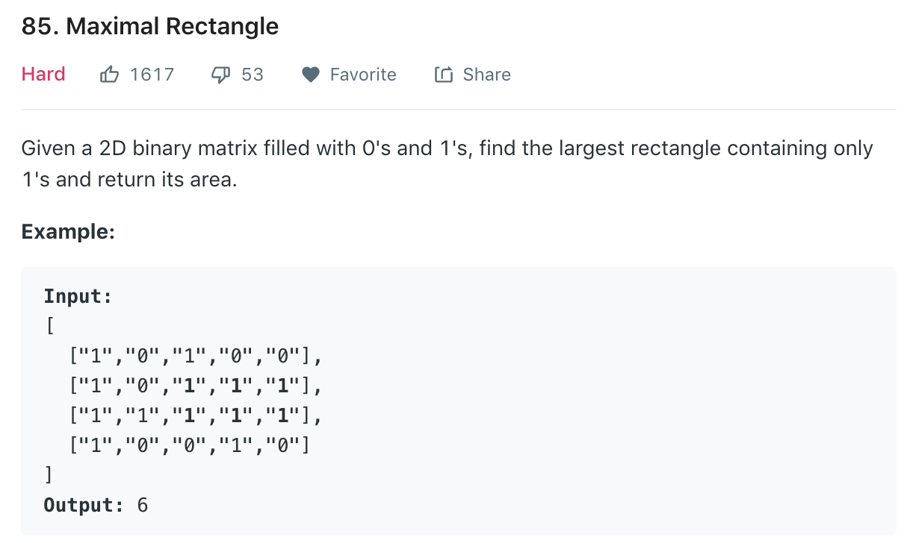
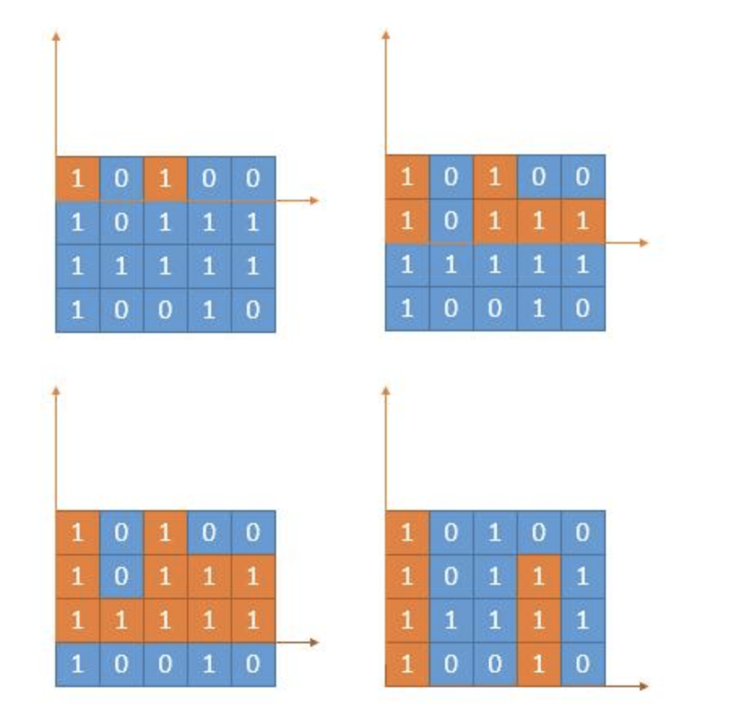
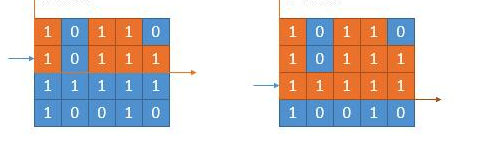
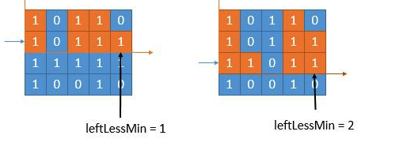

### Solution 1 Convert to 84

Checking the orange region, exactly the same as [84](84.md). We just need to calculate the height array of each layer, and pass it to our solution of 84.
```python
class Solution(object):
    def maximalRectangle(self, matrix):
        """
        :type matrix: List[List[str]]
        :rtype: int
        """
        if not matrix or len(matrix[0]) == 0:
            return 0
        row, col = len(matrix), len(matrix[0])
        maxArea = 0
        
        heights = [0] * col
        for i in range(row):
            for j in range(col):
            # iterate each column and update heights
                if matrix[i][j] == '1':
                    heights[j] += 1
                else:
                    heights[j] = 0
            # call last problem
            area = self.largestArea(heights)
            maxArea = max(area, maxArea)
        
        return maxArea
    
    def largestArea(self, heights):
        stack = []
        index = 0
        maxArea = 0
        
        while index < len(heights):
            if not stack or heights[index] >= heights[stack[-1]]:
                stack.append(index)
                index += 1
            else:
                top = stack.pop()
                leftBar = stack[-1] if stack else -1
                area = heights[top] * (index - leftBar - 1)
                maxArea = max(maxArea, area)
        
        while stack:
            top = stack.pop()
            leftBar = stack[-1] if stack else -1
            area = heights[top] * (index - leftBar - 1)
            maxArea = max(maxArea, area)
        
        return maxArea
```
+ Time complexity: O(mn)
+ Space complexity: O(n)
  
### Solution 2 Stack
Based on solution 1, we actually do not need to explicitly call function. As stack do not take in all the heights at a time, we can combine stack with the heights, operate the stack each time we get a new height.
```python
class Solution(object):
    def maximalRectangle(self, matrix):
        if len(matrix) == 0:
            return 0
        heights = [0] * (len(matrix[0]) + 1)
        maxArea = 0

        for row in range(len(matrix)):
            stack = []
            heights[-1] = 0

            for col in range(len(matrix[0]) + 1):
                if col < len(matrix[0]): #As we have a rear extra element
                    if matrix[row][col] == '1':
                        heights[col] += 1
                    else:
                        heights[col] = 0

                if not stack or heights[col] >= heights[stack[-1]]:
                    stack.append(col)
                else:
                    # If new stack top is higher than current height 
                    while stack and heights[col] < heights[stack[-1]]:
                        height = heights[stack.pop()]
                        leftBar = stack[-1] if stack else -1
                        rightBar = col
                        area = (rightBar - leftBar - 1) * height
                        maxArea = max(area, maxArea)
                    # push current index as it's higher than stack top
                    stack.append(col)

        return maxArea
```
Note the second while loop in [84](84.md) is to handle the remaining elements in the stack after iterating through all heights. Here we add an extra *0* to the rear of heights, s.t. at the last iteration we are ensured to enter the first while loop.

### Solution 3 DP
Refer to [here](https://leetcode.com/problems/maximal-rectangle/discuss/29054/Share-my-DP-solution).<br>
Based on DP solution in 84. When we go to next layer, if all number in new layer is 1, like below  lessFromLeft[] does not need to change. Otherwise,  lessFromLeft[i] will be either lessFromLeft[i] from last layer or the position of last 0, depending on which one is bigger.
```python
class Solution(object):
    def maximalRectangle(self, matrix):
        if not matrix:
            return 0

        maxArea = 0
        col = len(matrix[0])
        lessFromLeft = [-1] * col
        lessFromRight = [col] * col
        heights = [0] * col

        for i in range(len(matrix)):
            #update height of current level
            for j in range(col):
                if matrix[i][j] == '1':
                    heights[j] += 1
                else:
                    heights[j] = 0
            # update lessFromLeft
            boundary = -1 #last 0
            for j in range(col):
                if matrix[i][j] == '1':
                    lessFromLeft[j] = max(lessFromLeft[j], boundary)
                else:
                    lessFromLeft[j] = -1
                    boundary = j
            # update lessFromRight
            boundary = col
            for j in reversed(range(col)):
                if matrix[i][j] == '1':
                    lessFromRight[j] = min(lessFromRight[j], boundary)
                else:
                    lessFromRight[j] = col
                    boundary = j
            # update all area
            for j in reversed(range(col)):
                area = (lessFromRight[j] - lessFromLeft[j] - 1) * heights[j]
                maxArea = max(area, maxArea)

        return maxArea
```
