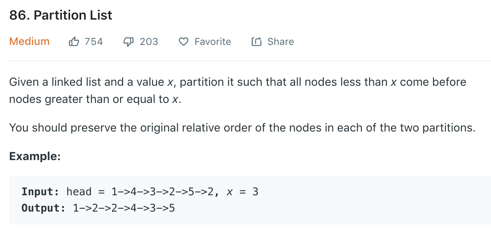

### Solution
Refer to [here](https://leetcode.com/problems/partition-list/solution/).<br>
```
[1 4 3 2 5 2] x=3
small = [1 2 2], big = [4 3 5]
concatenate we get ans = [1 2 2 4 3 5]
```
For LinkedList, we only need to change the pointer. We use smaller as the sublist smaller than x, and bigger for ...
```python
class Solution(object):
    def partition(self, head, x):
        """
        :type head: ListNode
        :type x: int
        :rtype: ListNode
        """
        smallerHead, biggerHead = ListNode(0), ListNode(0)
        smaller, bigger = smallerHead, biggerHead
        #Traversing whole list
        while head:
            if head.val < x:
                smaller.next = head
                smaller = smaller.next
            else:
                bigger.next = head
                bigger = bigger.next
            head = head.next
        #joining smaller and bigger sub-list
        smaller.next = biggerHead.next
        # Otherwise we get a circle
        bigger.next = None
        
        return smallerHead.next
```
