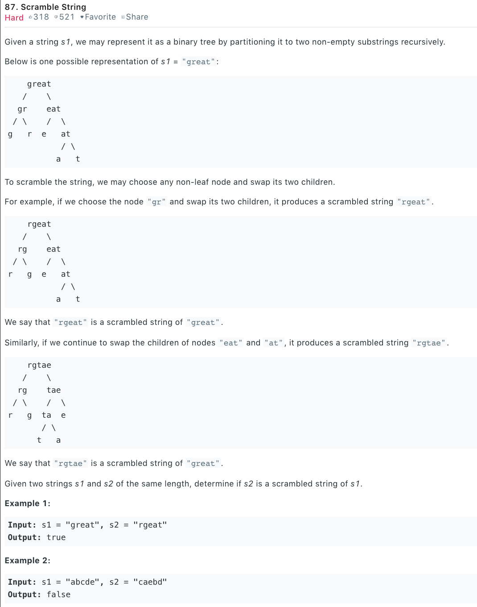

### Solution
We just need to iterate all cutting point.
```python
class Solution(object):
    def isScramble(self, s1, s2):
        """
        :type s1: str
        :type s2: str
        :rtype: bool
        """
        if s1 == s2: return True
        if len(s1) != len(s2): return False
        #check if num of each char is the same in s1 and s2
        count_buff = [0] * 26
        for i in range(len(s1)):
            count_buff[ord(s1[i]) - 97] += 1
            count_buff[ord(s2[i]) - 97] -= 1
        for c in count_buff:
            if c != 0: return False
        
        # iterating all possible cutting point
        for i in range(1, len(s1)):
            # case 1 first cut then decide if the two parts scramble 
            if self.isScramble(s1[:i], s2[:i]) and self.isScramble(s1[i:], s2[i:]):
                return True
            # case 2 first swap then scramble
            if self.isScramble(s1[:i], s2[len(s2) - i:]) and self.isScramble(s1[i:], s2[:len(s2) - i]):
                return True
        return False
```

+ Add memoization
```python
class Solution(object):
    def isScramble(self, s1, s2):
        mem = {}
        return self.dfs(s1, s2, mem)

    def dfs(self, s1, s2, mem):
        k = s1 + '@' + s2
        if k in mem:
            return mem[k]
        
        if s1 == s2:
            mem[k] = True
            return True
        
        if len(s1) != len(s2):
            mem[k] = False
            return False
        
        count_buff = [0] * 26
        for i in range(len(s1)):
            count_buff[ord(s1[i]) - 97] += 1
            count_buff[ord(s2[i]) - 97] -= 1
        for c in count_buff:
            if c != 0:
                mem[k] = False
                return False
        
        for i in range(1, len(s1)):
            if self.dfs(s1[i:], s2[i:], mem) and self.dfs(s1[:i], s2[:i], mem):
                mem[k] = True
                return True
            if self.dfs(s1[i:], s2[:len(s1) - i], mem) and self.dfs(s1[:i], s2[len(s1) - i:], mem):
                mem[k] = True
                return True
        
        mem[k] = False
        return False
```