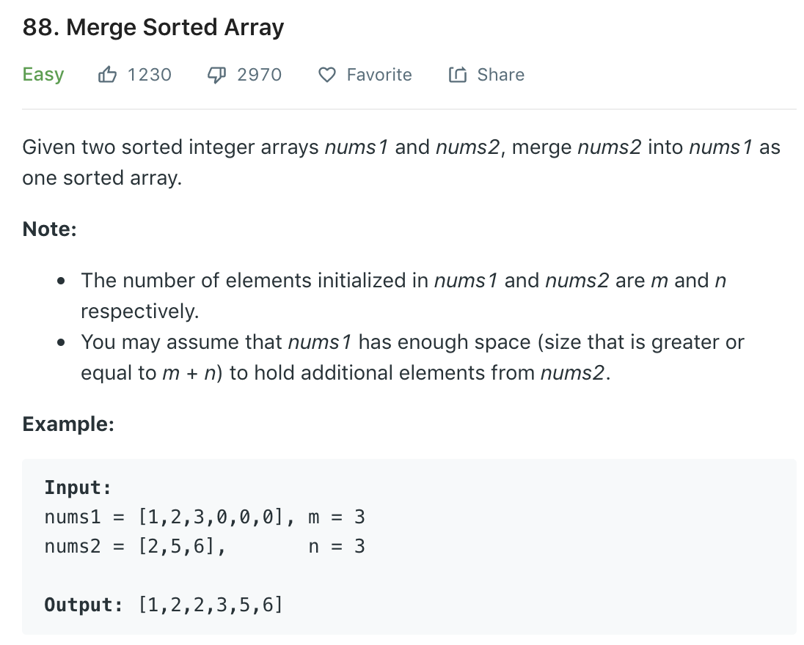

### Solution
It's trivial to use space O(m)
```python
class Solution(object):
    def merge(self, nums1, m, nums2, n):
        temp = nums1[:m]
#         i for position in temp, j for position in nums2, k for in-place position in nums1
        i, j, k = 0, 0, 0
        while i < m and j < n:
            if nums2[j] < temp[i]:
                nums1[k] = nums2[j]
                j += 1
            else:
                nums1[k] = temp[i]
                i += 1
            k += 1
#           left elements in temp
        if i < m:
            nums1[k:] = temp[i:]
        # while i < m:
        #     nums1[k] = temp[i]
        #     i += 1
        #     k += 1

        if j < n:
            nums1[k:] = nums2[j:]
        return nums1
```
But by merging from the rear, we can reduce space complexity to O(1).
```python
class Solution(object):
    def merge(self, nums1, m, nums2, n):
        """
        :type nums1: List[int]
        :type m: int
        :type nums2: List[int]
        :type n: int
        :rtype: None Do not return anything, modify nums1 in-place instead.
        """
        i, j, k = m-1, n-1, m+n-1
        while i >= 0 and j >= 0:
            if nums1[i] > nums2[j]:
                nums1[k] = nums1[i]
                i -= 1
            else:
                nums1[k] = nums2[j]
                j -= 1
            k -= 1
        while j >= 0:
            nums1[k] = nums2[j]
            j -= 1
            k -= 1
        # OR
        # if j >= 0:
        #     nums1[:k+1] = nums2[:j+1]
```

```python
class Solution(object):
    def merge(self, nums1, m, nums2, n):
        i, j, k = m-1, n-1, m+n-1
        while j >= 0:
            if i < 0:
                while j >= 0:
                    nums1[k] = nums2[j]
                    k -= 1
                    j -= 1
                return
                # break
                # NOTE if break is the same level with if, codes below willnot be reached
            if nums1[i] > nums2[j]:
                nums1[k] = nums1[i]
                k -= 1
                i -= 1
            else:
                nums1[k] = nums2[j]
                k -= 1
                j -= 1
```