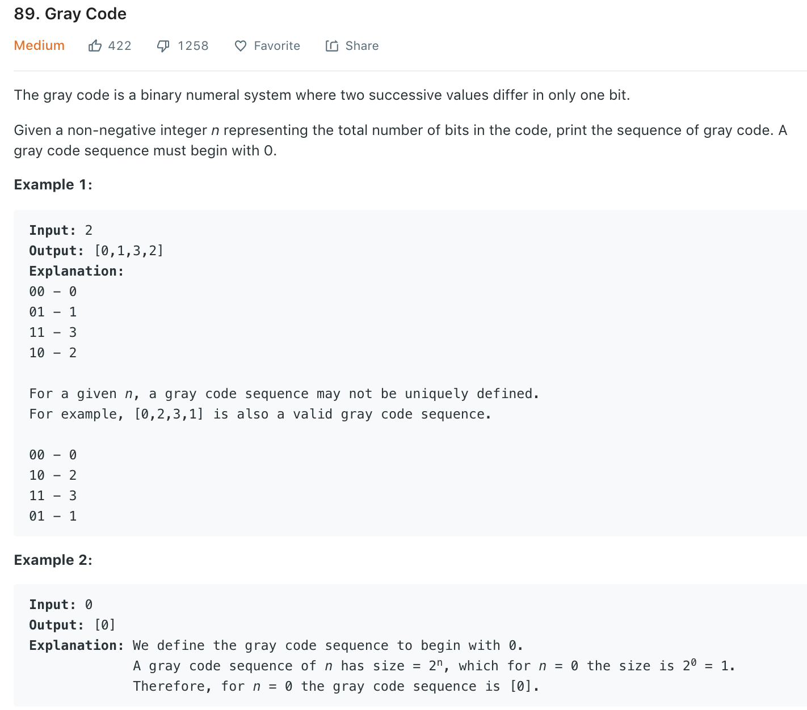
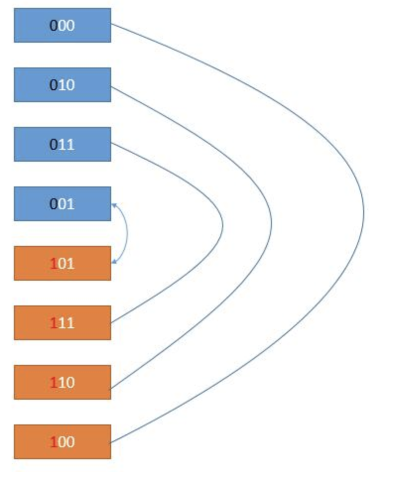

### Solution 1 backtracing
We start from 0, then try to change one bit based on last code each time.
```python
class Solution(object):
    def grayCode(self, n):
        """
        :type n: int
        :rtype: List[int]
        """
        ans = self.dfs(n, [[0]*n])
        # converting e.g., [010] -> 2
        for i in range(len(ans)):
            num = 0
            for n in ans[i]:
                num = (num << 1) + n
            ans[i] = num
        return ans
    
    def dfs(self, n, codes):
        if len(codes) == 1 << n:
            return codes

        for i in range(n):
            next = codes[-1][::]
            next[i] = next[i] ^ 1
            if next in codes:
                # if all next failed, we won't go to return line, and will return None
                continue
            return self.dfs(n, codes + [next])
```
### Solution 2 DP

```python
class Solution(object):
    def grayCode(self, n):
        res = [0]
        for i in range(n):
            extra = 1 << i
            n = len(res)
            for j in reversed(range(n)):
                res.append(res[j]+extra)
        
        return res
```
+ Time complexity: O(2^n)
+ Space complexity: O(1)s
### Solution 3 
Formula of Gray Code generation: Gi = Bi+1 ^ Bi
```python
class Solution(object):
    def grayCode(self, n):
        gray = []
        for binary in range(1 << n):
            gray.append(binary ^ (binary >> 1))
        return gray
```