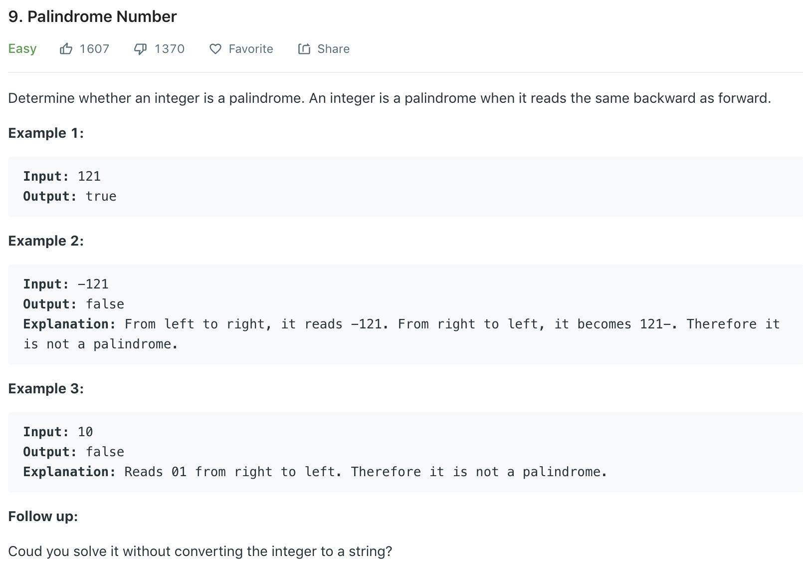

### Solution
```python
class Solution(object):
    def isPalindrome(self, x):
        """
        :type x: int
        :rtype: bool
        """
        if x < 0: return False
        
        digits = []
        while x:
            digits.append(x % 10)
            x //= 10
        
        l, r = 0, len(digits) - 1
        while l < r:
            if digits[l] != digits[r]:
                return False
            l += 1
            r -= 1
            
        return True
```