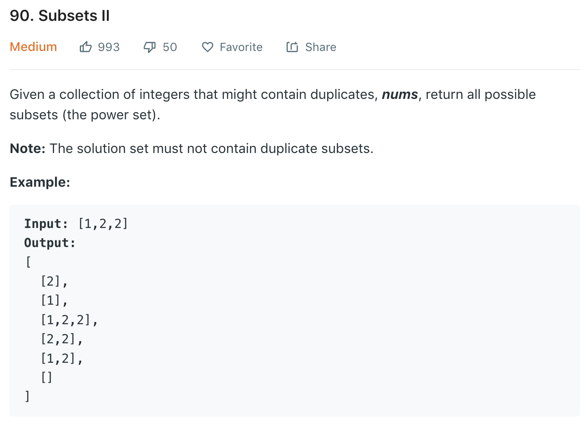

### Solution 1 backtracing
Similar to [78](78.md)<br>
First sort nums, then do backtracing. To handle duplicate case, we need to compare current number with previous one.
```python
class Solution(object):
    def subsetsWithDup(self, nums):
        """
        :type nums: List[int]
        :rtype: List[List[int]]
        """
        list.sort(nums)
        res = []
        def dfs(start, path):
            res.append(path)

            for i in range(start, len(nums)):
                if i > start and nums[i] == nums[i - 1]:
                    continue
                dfs(i + 1, path + [nums[i]])

        dfs(0, [])
        return res
```
### Solution 2 Iteration
Refer to [here](https://leetcode.com/problems/subsets-ii/discuss/30168/C%2B%2B-solution-and-explanation).<br>
When there are n duplicate number, we need to add 1 dup, 2 dup ... n dup to previous subsets. For ex, [1, 3, 3]<br>
[], add 1 -> [[], [1]], we have two duplicate 3, then traverse existing subsets:<br>
- for []<br>
  add one 3, [3]<br>
  add two 3, [3, 3]
- for subset [1]<br>
  add one 3, [1, 3]<br>
  add two 3, [1, 3, 3]

```python
class Solution(object):
    def subsetsWithDup(self, nums):
        res = [[]]
        i = 0
        while i < len(nums):
            dupCount = 1
            while i < len(nums) - 1 and nums[i] == nums[i + 1]:
                dupCount += 1
                i += 1
            size = len(res)
            for j in range(size):
                element = res[j]
                # element = res[j][::]
                for k in range(dupCount):
                    element = element + [nums[i]]
                    # element.append(nums[i])
                    res.append(element[::])
            i += 1
        
        return res
```