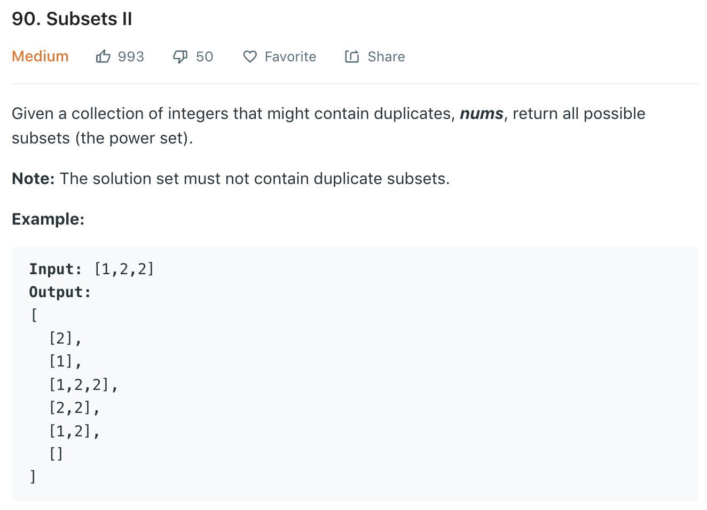

### Solution 1 backtracing
Similar to [78](78.md)<br>
First sort nums, then do backtracing. To handle duplicate case, we need to compare current number with previous one.
```python
class Solution(object):
    def subsetsWithDup(self, nums):
        """
        :type nums: List[int]
        :rtype: List[List[int]]
        """
        list.sort(nums)
        res = []
        def dfs(start, path):
            res.append(path)

            for i in range(start, len(nums)):
                if i > start and nums[i] == nums[i - 1]:
                    continue
                dfs(i + 1, path + [nums[i]])

        dfs(0, [])
        return res
```
### Solution 2 Iteration
Refer to [here](https://leetcode.com/problems/subsets-ii/discuss/30168/C%2B%2B-solution-and-explanation).<br>
When there are n duplicate number, we need to add 1 dup, 2 dup ... n dup to previous subsets. For ex, [1, 3, 3]<br>
[], add 1 -> [[], [1]], we have two duplicate 3, then traverse existing subsets:<br>
- for []<br>
  add one 3, [3]<br>
  add two 3, [3, 3]
- for subset [1]<br>
  add one 3, [1, 3]<br>
  add two 3, [1, 3, 3]

```python
class Solution(object):
    def subsetsWithDup(self, nums):
        res = [[]]
        i = 0
        while i < len(nums):
            dupCount = 1
            while i < len(nums) - 1 and nums[i] == nums[i + 1]:
                dupCount += 1
                i += 1
            size = len(res)
            for j in range(size):
                element = res[j]
                # element = res[j][::]
                for k in range(dupCount):
                    element = element + [nums[i]]
                    # element.append(nums[i])
                    res.append(element[::])
            i += 1
        
        return res
```

### !!! Error solution
```python
fix subsets 2:
class Solution:
    def subsetsWithDup(self, nums: List[int]) -> List[List[int]]:
        nums.sort()
        res = []
        def dfs(start, cur):
            if start == len(nums):
                res.append(cur)
                return
            if start == 0 or nums[start] != nums[start-1]:
                dfs(start+1, cur+[nums[start]])
            dfs(start+1, cur)
        dfs(0, [])
        return res
```
为什么你原来的 DFS 逻辑有点绕？
你原来的代码逻辑是基于“索引推进”的，但在处理重复时，它很难区分“这个重复数字是上一层传下来的”还是“这一层新选的”。

回溯法的逻辑直觉：

排序：把相同的数字聚在一起（比如 [1, 2, 2]）。

同层去重：想象你在选第一个数字，你选了第一个 2。当你回溯回来，想选第二个 2 时，你会发现它跟刚才选的一模一样，于是你跳过它。

深度继续：虽然你在同层跳过了第二个 2，但在递归到下一层时，你依然可以选第二个 2（形成 [2, 2]）。