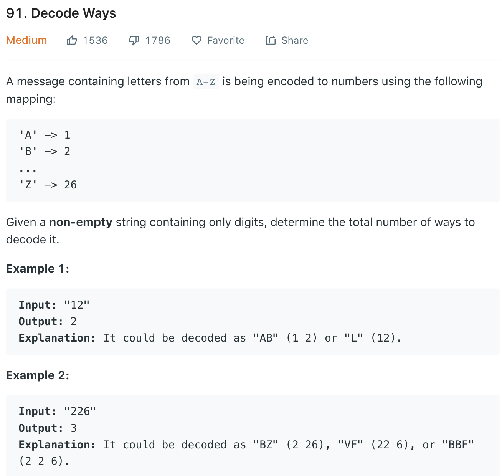

### Solution 1 DP
dp[i] stores the number of decodings for substring of length i. We check one digit and two digit combination and save the result along the way. Finally, dp[n] will give us the result. **Note** for s = '201', only 1 valid decoding ['20', '1'], decoding['2','01'] is not valid. So the range of the two digit combination should be *[10, 26]*
```python
class Solution(object):
    def numDecodings(self, s):
        """
        :type s: str
        :rtype: int
        """
        if not s: return 0
        dp = [0 for _ in range(len(s) + 1)]
        dp[0] = 1
        dp[1] = 0 if s[0] == '0' else 1
        for i in range(2, len(s) + 1):
            # the current digit
            first = int(s[i - 1])
            second = int(s[i - 2 : i])
            if first != 0:
                dp[i] += dp[i - 1]
            if 10 <= second <= 26:
                dp[i] += dp[i - 2]
        
        return dp[len(s)]
```
+ Without using int(), trivial speed optimization
```python
class Solution(object):
    def numDecodings(self, s):
        if s is None or len(s) == 0 or s[0] == '0':
            return 0
        dp = [0] * (len(s) + 1)
        dp[0] = 1
        for i in range(1, len(s) + 1):
            if s[i - 1] != '0':
                dp[i] += dp[i - 1]
            # note '09' instead of '9' as string comparison is digit by digit, i.e., '9' > '27'
            if i != 1 and '09' < s[i - 2 : i] < '27':
                dp[i] += dp[i - 2]
        
        return dp[-1]
```
+ Space optimization (we only need previous 2 results)
```python
class Solution(object):
    def numDecodings(self, s):
        a=1
        b=1 if s[0]!="0" else 0

        for i in range(1,len(s)):
            temp=0
            if int(s[i])>0:
                temp+=b
            if 10<=int(s[i-1:i+1])<=26:
                temp+=a
            a,b=b,temp
        return b
```
### Solution 2 Recursion (with memoization)
123xxx -> 1|23xxx + 12|3xxx<br>
```python
class Solution(object):
    def numDecodings(self, s):
        n = len(s)
        mem = {}
        def func(i):
        #func(i) returns the number of decoding ways of s[i:]
            if i >= n:
                return 1
            if s[i] == '0':
                return 0
            
            if i in mem:
                return mem[i]

            if i < n - 1 and s[i : i+2] <= '26':
                mem[i] = func(i + 1) + func(i + 2)
            else:
                mem[i] = func(i + 1)
            
            return mem[i]

        return func(0)
```