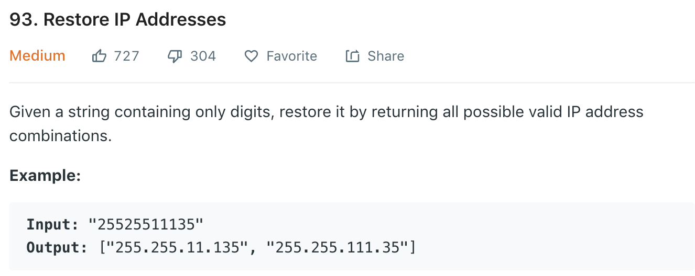

### Solution backtracing recursion DFS
Similar to [91](91.md), partition of string. We know the string should be split to 4 parts, each part could have 1 digit, or 2 or 3 digits, then we have recursion.<br>
Note element starting with 0 (except 0 itself) is invalid, e.g., 01.1.001.1
```python
class Solution(object):
    def restoreIpAddresses(self, s):
        """
        :type s: str
        :rtype: List[str]
        """
        res = []
        self.dfs(0, s, [], res)
        return res

    def dfs(self, start, s, path, res):
        # if the remaining s is too long s.t. even if each part have 3 chars we still have remaining chars in s
        if len(s) - start > 3 * (4 - len(path)):
            return
        # reached end of s
        if start == len(s):
            if len(path) == 4:
                res.append(".".join(path))
            return
        
        # add 1 digit
        self.dfs(start + 1, s, path + [s[start]], res)

        if s[start] == '0':
            return

        # add 2 digits
        if start < len(s) - 1:
            self.dfs(start + 2, s, path + [s[start : start+2]], res)

        # add 3 digits
        if start < len(s) - 2:
            if '000' < s[start: start+3] <= '255':
                self.dfs(start + 3, s, path + [s[start : start+3]], res)
```

### Solution 2
Refer to [here](https://leetcode.com/problems/restore-ip-addresses/discuss/30949/My-code-in-Java).<br>
Brutal force, since we know there is 4 parts, just traverse all possible combinations. Use 3 pointers as partition position, and check if each part is valid.
```python
class Solution(object):
    def restoreIpAddresses(self, s):
        def isValid(t):
            if len(t) == 0 or len(t) > 3 or (t[0] == '0' and len(t) > 1) or int(t) > 255:
                return False
            return True

        res = []
        # i < 4: the first part has less than 4 digits
        # i < len(s) - 2: make sure the rest of s can be partitioned to 3 parts
        for i in range(1, min(4, len(s)-2)):
            for j in range(i+1, min(i+4, len(s) - 1)):
                for k in range(j+1, min(j+4, len(s))):
                    s1, s2, s3, s4 = s[:i], s[i:j], s[j:k], s[k:]
                    if isValid(s1) and isValid(s2) and isValid(s3) and isValid(s4):
                        res.append(s1+'.'+s2+'.'+s3+'.'+s4)
        
        return res
```