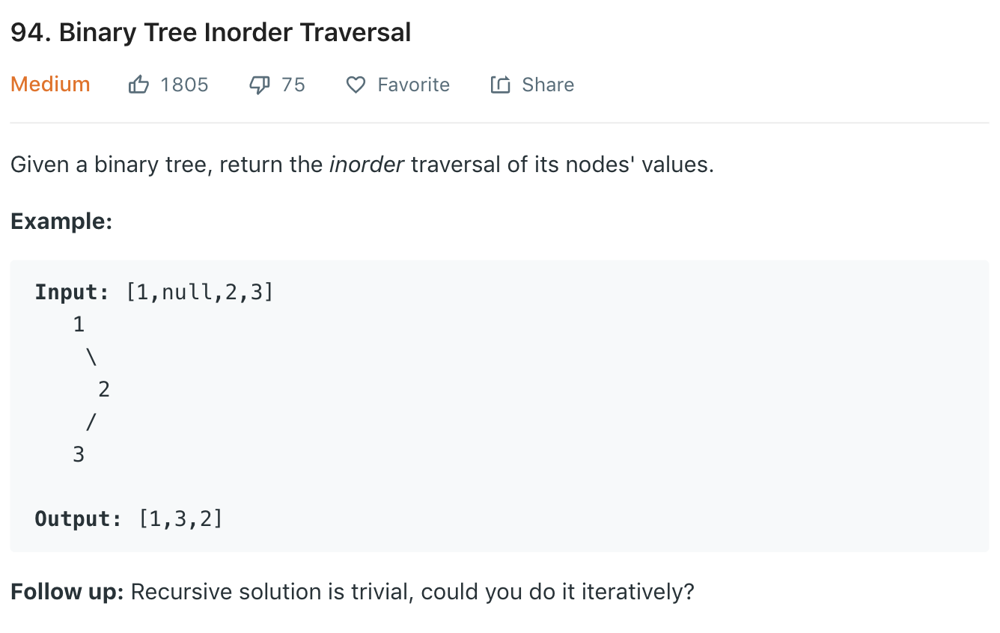

### Solution 1 Recursion
```python
class Solution(object):
    def inorderTraversal(self, root):
        """
        :type root: TreeNode
        :rtype: List[int]
        """
        ret = []
        self.inorder(root, ret)
        return ret
    
    def inorder(self, root, ret):
        if not root:
            return
        self.inorder(root.left, ret)
        ret.append(root.val)
        self.inorder(root.right, ret)
```

### Solution 2 Iteration
```python
class Solution(object):
    def inorderTraversal(self, root):
        ans = []
        stack = []
        cur = root
        while cur or stack:
            # while node is not null, push stack
            while cur:
                stack.append(cur)
                cur = cur.left
            # node is null, pop stack
            cur = stack.pop()
            # add current val
            ans.append(cur.val)
            # right sub-tree
            cur = cur.right
        return ans
```