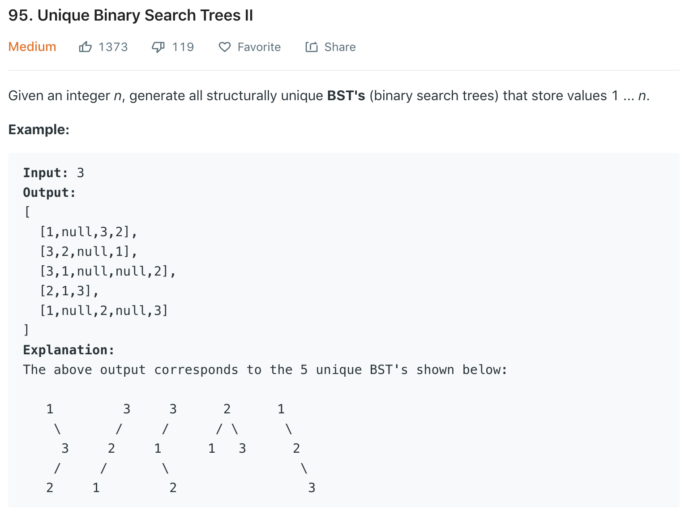

### Solution
```python
class TreeNode(object):
    def __init__(self, x):
        self.val = x
        self.left = None
        self.right = None

class Solution(object):
    def generateTrees(self, n):
        """
        :type n: int
        :rtype: List[TreeNode]
        """
        if n == 0: return []
        return self.treeHelper(1, n)
    
    def treeHelper(self, start, end):
    # return a list of trees comprised of nodes in range [start, end]
        if start > end:
            return [None]
        if start == end:
            return [TreeNode(start)]
        subs = []
        # pick root node
        for m in range(start, end + 1):
            leftTree = self.treeHelper(start, m - 1)
            rightTree = self.treeHelper(m + 1, end)
            # combination
            for lnode in leftTree:
                for rnode in rightTree:
                    root = TreeNode(m)
                    root.left = lnode
                    root.right = rnode
                    subs.append(root)
        return subs
```

An optimization is to add memoization to store some intermediate results. (Extra space to reduce time)

```python
class Solution(object):
    def generateTrees(self, n):
        def helper(l, r, memo):
            if l > r:
                return [None]

            if (l, r) in memo:
                return memo[(l, r)]

            res = []
            for i in range(l, r + 1):
                lTrees = helper(l, i - 1, memo)
                rTrees = helper(i + 1, r, memo)
                for lNode in lTrees:
                    for rNode in rTrees:
                        root = TreeNode(i)
                        root.left = lNode
                        root.right = rNode
                        res.append(root)
            memo[(l, r)] = res
            return res

        if n == 0:
            return None

        memo = {}
        res = helper(1, n, memo)
        return res
```