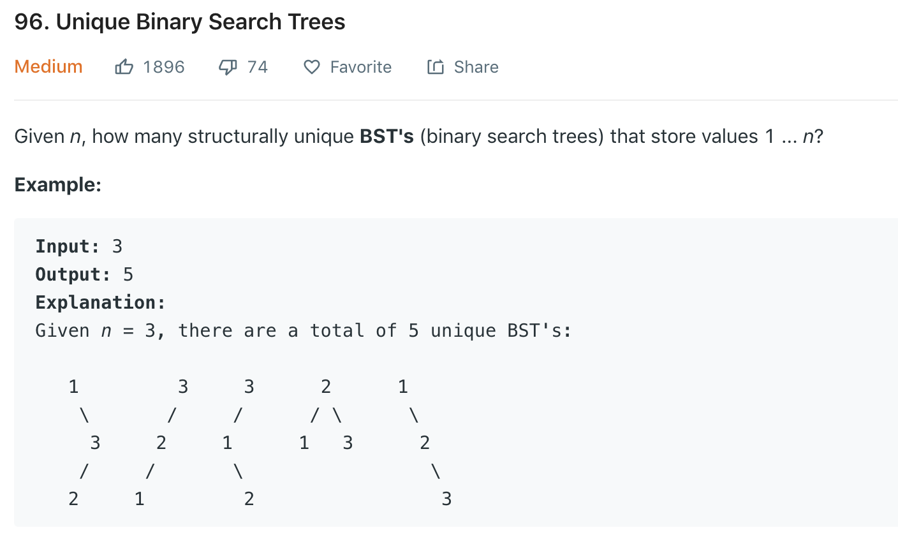

### Solution 1 Recursion
Similar to [95](95.md), but we only need the number of tree structures. Note in 95, we need to pass in the *start* and *end* value to construct the tree, here we only need to pass in the number of nodes.
```python
class Solution(object):
    def numTrees(self, n):
        """
        :type n: int
        :rtype: int
        """
        if n == 0: return 0
        mem = dict()
        return self.helper(n, mem)
    
    def helper(self, n, mem):
    """return the number of structures using n nodes"""
        # if the case of n nodes have been calculated before and stored in mem
        if n in mem:
            return mem[n]
        
        count = 0
        if n == 0 or n == 1:
            return 1

        for i in range(1, n + 1):
            leftCount = self.helper(i - 1, mem)
            rightCount = self.helper(n - i, mem)
            count += leftCount * rightCount
        
        mem[n] = count
        return count
```

### Solution 2 DP
In solution 1, we push stack from top-down and pop stack at the base condition. Here we start from the initial case and do bottom-up with memoization.
```python
class Solution(object):
    def numTrees(self, n):
        # dp[i] is the number of structures using i nodes
        dp = [0] * (n + 1)
        dp[0] = 1
        #len from 1 to n
        for len in range(1, n + 1):
            # pick a root
            for root in range(1, len + 1):
                left = root - 1 # length of left sub-tree
                right = len - root #length of right sub-tree
                dp[len] += dp[left] * dp[right]

        return dp[n]
```
Refer to [this](https://leetcode.com/problems/unique-binary-search-trees/discuss/31815/A-0-ms-c%2B%2B-solution-with-my-explanation). Further optimization.

We can reduce the number of inner loops using symmetry.
- n is even, e.g., 1 2 | 3 4 In the inner for loop we use each number as root and calculate solution. We actually only need to calculate half. As 1 and 4, 2 and 3 has the same counts.
-  n is odd, e.g., 1 2 | 3 | 4 5 Only calculate half plus the 3 in the middle.
```python
class Solution(object):
    def numTrees(self, n):
        # dp[i] is the number of structures using i nodes
        dp = [0] * (n + 1)
        dp[0] = 1
        dp[1] = 1
        #len from 1 to n
        for len in range(2, n + 1):
            # pick a root
            for root in range(1, (len >> 1) + 1):
                left = root - 1 # length of left sub-tree
                right = len - root #length of right sub-tree
                dp[len] += dp[left] * dp[right]
            
            dp[len] *= 2
            # n is odd
            if len & 1 == 1:
                root = (len >> 1) + 1
                left = root - 1
                right = len - root
                dp[len] += dp[left] * dp[right]

        return dp[n]
```

### Solution 3 catalan
Refer to [here](https://leetcode.com/problems/unique-binary-search-trees/discuss/31671/A-very-simple-and-straight-ans-based-on-MathCatalan-Number-O(N)).
<script type="text/javascript"
   src="http://cdn.mathjax.org/mathjax/latest/MathJax.js?config=TeX-AMS-MML_HTMLorMML">
</script>
let h(0) = 1, <br>
h(n) = h(0)*h(n-1) + h(1)*h(n-2) + ... + h(n-1)*h(0) (n >= 1) and we have formula:
$$C_{n} = \frac{1}{n+1}\binom{2n}{n} = \frac{(2n)!}{n!(n+1)!}$$
$C_{n} = 2n*(2n-1)*...*(n+1)/(n+1)!$
```python
class Solution(object):
    def numTrees(self, n):
        ans = 1
        for i in range(1, n + 1):
            ans = ans * (n + i) / i
        return int(ans / (n + 1))
```