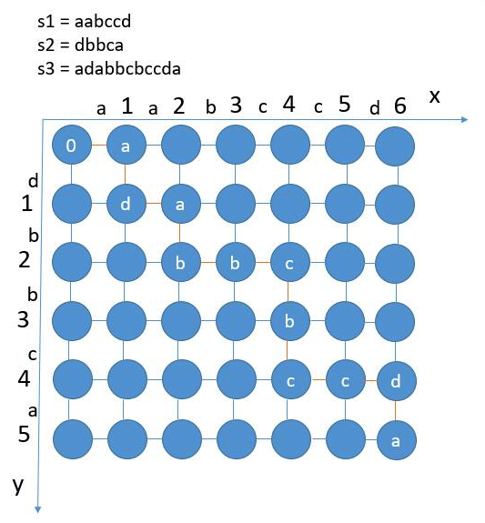

### Solution 1 backtracing (TLE)
```python
class Solution(object):
    # TLE
    def isInterleave(self, s1, s2, s3):
        """
        :type s1: str
        :type s2: str
        :type s3: str
        :rtype: bool
        """
        if len(s1) + len(s2) != len(s3):
            return False
        return self.dfs(s1, 0, s2, 0, s3, 0)

    #return if we can form s3[k:] using s1[i:] and s2[j:]
    def dfs(self, s1, i, s2, j, s3, k):
        if i == len(s1) and j == len(s2) and k == len(s3):
            return True
        # i reach the end, move and cmp s2[j], s3[k]
        if i == len(s1):
            while j < len(s2):
                if s2[j] != s3[k]:
                    return False
                j += 1
                k += 1
            return True
        # j reach the end
        if j == len(s2):
            while i < len(s1):
                if s1[i] != s3[k]:
                    return False
                i += 1
                k += 1
            return True
        # the current value in s1 equals the current value in s3
        if s1[i] == s3[k]:
            if self.dfs(s1, i+1, s2, j, s3, k+1):
                return True
        # the current value in s2 equals the current value in s3
        if s2[j] == s3[k]:
            if self.dfs(s1, i, s2, j+1, s3, k+1):
                return True

        return False
```
However, the above solution has TLE (time limit exceed) as we have many duplicate states during backtracing. To optimize, we add memoization.

```python
class Solution(object):
    def isInterleave2(self, s1, s2, s3):
        if len(s1) + len(s2) != len(s3):
            return False
        # use mem to store visited states
        mem = dict()
        def helper(s1, i, s2, j, s3, k):
            key = str(i) + '@' + str(j)
            if key in mem:
                return mem[key]

            if i == len(s1) and j == len(s2) and k == len(s3):
                mem[key] = True
                return True

            if i == len(s1):
                while j < len(s2):
                    if s2[j] != s3[k]:
                        mem[key] = False
                        return False
                    j += 1
                    k += 1
                mem[key] = True
                return True

            if j == len(s2):
                while i < len(s1):
                    if s1[i] != s3[k]:
                        mem[key] = False
                        return False
                    i += 1
                    k += 1
                mem[key] = True
                return True

            if s1[i] == s3[k]:
                if helper(s1, i+1, s2, j, s3, k+1):
                    mem[key] = True
                    return True

            if s2[j] == s3[k]:
                if helper(s1, i, s2, j+1, s3, k+1):
                    mem[key] = True
                    return True

            mem[key] = False
            return False

        return helper(s1, 0, s2, 0, s3, 0)
```

### Solution 2 DP
Refer to [here](https://leetcode.com/problems/interleaving-string/discuss/31879/My-DP-solution-in-C%2B%2B).<br>
dp[i][j] shows if we can use s1[0,i) and s2[0,j) to get s3[0, i+j)
+ if dp[i-1][j] == True and s1[i-1]==s3[i+j-1], dp[i][j]=True
+ if dp[i][j-1] == True and s2[j-1]==s3[i+j-1], dp[i][j]=True
  
```python
class Solution(object):
    def isInterleave(self, s1, s2, s3):
        if len(s1) + len(s2) != len(s3): return False

        dp = [[False for _ in range(len(s2)+1)] for _ in range(len(s1) + 1)]
        for i in range(len(s1) + 1):
            for j in range(len(s2) + 1):
                if i == 0 and j == 0:
                    dp[i][j] = True
                elif i == 0: #only use s2
                    dp[i][j] = dp[i][j-1] and s2[j-1] == s3[j-1]
                elif j == 0: #only use s1
                    dp[i][j] = dp[i-1][j] and s1[i-1] == s3[i-1]
                else:
                    dp[i][j] = (dp[i-1][j] and s1[i-1] == s3[i+j-1]) or \
                               (dp[i][j-1] and s2[j-1] == s3[i+j-1])
        return dp[-1][-1]
```
When updating dp[i][j], we only need dp[i-1][j] (i.e., the last row). So space can be optimized as we do not need a 2-d array.

```python
class Solution(object):
   def isInterleave(self, s1, s2, s3):
        if len(s1) + len(s2) != len(s3): return False
        dp = [False] * (len(s2) + 1)
        for i in range(len(s1) + 1):
            for j in range(len(s2) + 1):
                if i == 0 and j == 0:
                    dp[j] = True
                elif i == 0:
                    dp[j] = dp[j - 1] and s2[j - 1] == s3[j - 1]
                elif j == 0:
                    dp[j] = dp[j] and s1[i - 1] == s3[i - 1]
                else:
                    dp[j] = (dp[j] and s1[i - 1] == s3[i + j - 1]) or \
                            (dp[j - 1] and s2[j - 1] == s3[i + j - 1])
        return dp[-1]
```

### Solution 3 BFS


The (i, j) node represents we can get s3[:i+j) using s1[:i) and s2[:j). The problem is equivalent to: starting from the upper left (0, 0) and trying to get to the bottom right, can only move right or down each step. Note we can not always move. Here we use BFS to traverse the whold graph.

```python
class Solution(object):
    def isInterleave(self, s1, s2, s3):
        if len(s1) + len(s2) != len(s3):
            return False
        queue = []
        visited = []
        queue.append((0, 0))
        while queue:
            # dequeue the current node
            cur = queue.pop(0)
            x, y = cur[0], cur[1]
            # we've successfully reached the bottom right, Done
            if x == len(s1) and y == len(s2):
                return True
            # visit and enqueue the below neighbor
            if x < len(s1) and s1[x] == s3[x + y]:
                if (x+1, y) not in visited:
                    visited.append((x+1, y))
                    queue.append((x+1, y))
            # visit and enqueue the right neighbor
            if y < len(s2) and s2[y] == s3[x + y]:
                if (x, y+1) not in visited:
                    visited.append((x, y+1))
                    queue.append((x, y+1))
        return False
```