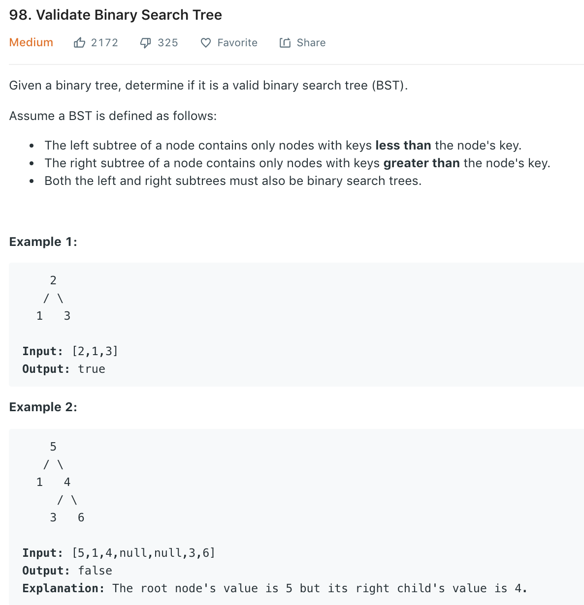

### Solution (wrong)

The following solution will fail for [5, 1, 10, null, null, 3]
```python
class Solution(object):
    def isValidBST(self, root):
        """
        :type root: TreeNode
        :rtype: bool
        """
        if not root:
            return True
        # we not only need root.val > root.left.val but need the root.val > node.val
        # for any node in left subtree
        if root.left and ((root.val <= root.left.val) or not self.isValidBST(root.left)):
            return False
        if root.right and ((root.val >= root.right.val) or not self.isValidBST(root.right)):
            return False
        return True
```

### Solution 1
```python
class Solution(object):
    def isValidBST(self, root):
        def getMax(node):
        # find the maximum node val in the sub-tree
            max = node.val
            while node.right:
                max = node.right.val
                node = node.right
            return max

        def getMin(node):
            min = node.val
            while node.left:
                min = node.left.val
                node = node.left
            return min

        if not root:
        # => not root or (not root.left and not root.right):
        # thus we do not need the final return True
            return True

        if root.left:
            if self.isValidBST(root.left):
                maxVal = getMax(root.left)
                if root.val <= maxVal:
                    return False
            else:
                return False

        if root.right:
            if self.isValidBST(root.right):
                minVal = getMin(root.right)
                if root.val >= minVal:
                    return False
            else:
                return False

        return True
```

### Solution 2 Inorder traversal

If we inorder traverse a valid BST, the output result should be an increasing sequence. More specifically, we only need to compare the current value with the previous value during traversal.
```python
class Solution(object):
    def isValidBST(self, root):
        if not root:
            return True
        stack = []
        pre = None
        while root or stack:
            while root:
                stack.append(root)
                root = root.left
            # current value 
            root = stack.pop()
            # compare with previous value
            if pre and root.val <= pre.val:
                return False
            pre = root

            root = root.right
        return True
```

### Solution 3.1 Check if node value in valid range - recursively
Refer to [here](https://leetcode.com/problems/validate-binary-search-tree/solution/)

The root can be any value, so the range for a valid root is (-inf, +inf). The range of child should be bounded by its parents. For left child: (lower bound of its parent, parent value), for right child: (parent value, upper bound of its parent)
```python
class Solution(object):
    def isValidBST(self, root):
        return self.helper(root, None, None)

    def helper(self, node, minVal, maxVal):
        if not node: return True

        if minVal is not None and node.val <= minVal:
            return False
        if maxVal is not None and node.val >= maxVal:
        # BE CAREFUL cannot use 'if maxVal and node.val >= maxVal'
        # as it will skip the comparison when maxVal == 0
            return False

        return self.helper(node.left, minVal, node.val) and \
               self.helper(node.right, node.val, maxVal)
```


### Solution 3.2 Iteratively BFS

```python
class Solution(object):
    def isValidBST(self, root)
        if not root or (not root.left and not root.right):
            return True
        # storing node and corresponding range
        queue = []
        minValQueue = []
        maxValQueue = []
        queue.append(root)
        minValQueue.append(None)
        maxValQueue.append(None)

        while queue:
            # check if front value in queue is valid and dequeue
            minVal = minValQueue.pop(0)
            maxVal = maxValQueue.pop(0)
            pNode = queue.pop(0)

            if minVal is not None and pNode.val <= minVal:
                return False
            if maxVal is not None and pNode.val >= maxVal:
                return False

            # enqueue left child
            if pNode.left:
                queue.append(pNode.left)
                minValQueue.append(minVal)
                maxValQueue.append(pNode.val)
            # enqueue right child
            if pNode.right:
                queue.append(pNode.right)
                minValQueue.append(pNode.val)
                maxValQueue.append(maxVal)
        return True

```