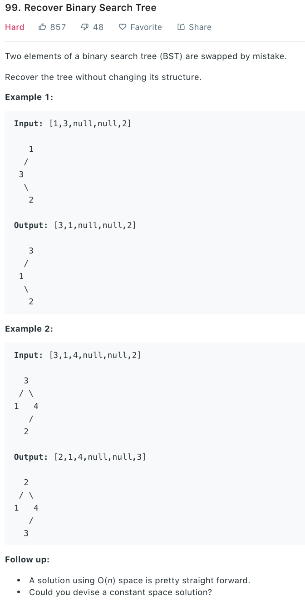

### Solution 1
all possible cases:
1. root and left node is swapped, to recover, swap root with the biggest node in left tree
2. root and right node is swapped
3. left node and right node is swapped
4. two left nodes are swapped 
5. two right nodes are swapped
```python
class Solution(object):
    def recoverTree(self, root):
        """
        :type root: TreeNode
        :rtype: None Do not return anything, modify root in-place instead.
        """
        if not root: return
        def getMaxOfBST(node):
        # find the biggest node
            if not node:
                return node
            maxL = getMaxOfBST(node.left)
            maxR = getMaxOfBST(node.right)
            if maxL and maxL.val > node.val:
                node = maxL
            if maxR and maxR.val > node.val:
                node = maxR
            return node

        def getMinOfBST(node):
        # find the smallest node
            if not node:
                return node
            minL = getMinOfBST(node.left)
            minR = getMinOfBST(node.right)
            res = node
            if minL and minL.val < res.val:
                res = minL
            if minR and minR.val < res.val:
                res = minR
            return res

        maxLeft = getMaxOfBST(root.left)
        minRight = getMinOfBST(root.right)
        # 3
        if maxLeft and minRight:
            if maxLeft.val > root.val and minRight.val < root.val:
                minRight.val, maxLeft.val = maxLeft.val, minRight.val
        if maxLeft:
            # 1
            if maxLeft.val > root.val:
                maxLeft.val, root.val = root.val, maxLeft.val

        if minRight:
            # 2
            if minRight.val < root.val:
                minRight.val, root.val = root.val, minRight.val

        self.recoverTree(root.left)#4
        self.recoverTree(root.right)#5
```

### Solution 2
Refer to [this](https://leetcode.com/problems/recover-binary-search-tree/discuss/32535/No-Fancy-Algorithm-just-Simple-and-Powerful-In-Order-Traversal).

For a valid BST, an inorder traversal will generate a sequence of increasing numbers. Here we swapped 2 nodes, which is equivalent to swap 2 number in the sequence.
* Swap 2 adjacent numbers
  
[1 2 3 4 5] if we swap 2 and 3, get [1 3 2 4 5], which contains one reverse order pair, we just need to iterate through the array, find and swap 3 2
* Swap 2 non-adjacent numbers
  
[1 2 3 4 5] if we swap 2 and 5, get [1 5 3 4 2], there are 2 reverse order pairs [5 3], [4 2]. We only need to find them and swap the first number 5 in the first pair with the second number 2 in the second pair.

In inorder traversal, we compare node **pre** with current node, if pre.val is bigger than current node's value, pre is the first node in the reverse pair. We store the pair using **first** and **second**. If a second reverse pair is found, update second. Finally, we swap first and second.

#### 1. Inorder traverse recursively

```python
class Solution(object):
    def recoverTree(self, root):
        self.first = None
        self.second = None
        self.pre = None
        self.inorderTraversal(root)
        self.first.val, self.second.val = self.second.val, self.first.val

    def inorderTraversal(self, root):
        if not root:
            return
        self.inorderTraversal(root.left)
        # >>>>
        if self.pre and root.val < self.pre.val:
            # meet reverse pair for the first time
            if not self.first:
                self.first = self.pre
                self.second = root
            # meet reverse pair for the second time 
            else:
                self.second = root
        self.pre = root
        # >>>>
        self.inorderTraversal(root.right)
```

#### 2. Inorder traverse iteratively
```python
class Solution(object):
    def recoverTree(self, root):
        self.first = None
        self.second = None
        self.inorder(root)
        self.first.val, self.second.val = self.second.val, self.first.val

    def inorder(self, root):
        if not root:
            return
        stack = []
        pre = None
        while root or stack:
            while root:
                stack.append(root)
                root = root.left
            root = stack.pop()
            # >>>>
            if pre and root.val < pre.val:
                if not self.first:
                    self.first = pre
                self.second = root
            pre = root
            # >>>>
            root = root.right
```